# el1zabethcodes/yatra

## Product Architecture and Request Flow/Frontend application shell, provider wiring, and route composition

# Product Architecture and Request Flow

The frontend is organized around a single app shell in `frontend/app/layout.jsx`. That shell injects shared client-side session state through `AuthProvider` from `frontend/lib/AuthContext.jsx` and places `FooterGate` after every routed page so footer visibility can be decided from the current pathname.

Route composition is then handled per entrypoint: `frontend/app/page.jsx`, `frontend/app/features/page.jsx`, `frontend/app/pricing/page.jsx`, `frontend/app/login/page.jsx`, and `frontend/app/dashboard/page.jsx` each build their own page chrome and local interaction model on top of the shared shell. The result is a split between global wiring in the layout and route-specific UI, with the dashboard and login routes relying heavily on `useAuth` for client-side state and redirects.

## Application Shell and Provider Wiring

### Root Layout and Footer Gate

*`frontend/app/layout.jsx`, `frontend/lib/AuthContext.jsx`, `frontend/components/shared/FooterGate.jsx`*

`RootLayout` is the only cross-route wrapper shown in the source. It imports `./globals.css`, sets `metadata`, and renders every page inside `AuthProvider`, followed by `FooterGate`. That means shared auth state is available before any page component renders, and footer decisions are made centrally after the routed content.

`FooterGate` is path-aware. It reads the current pathname with `usePathname`, compares it against the `hidden` list, and returns `null` for `/login`, `/signup`, and `/dashboard`. For all other paths it renders `Footer`.

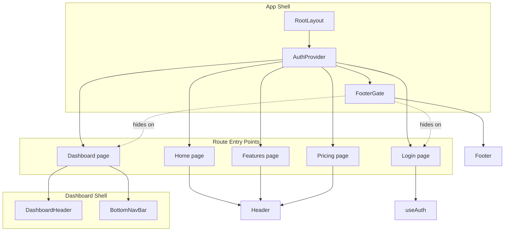

### Route Entry Points and Page Composition

frontend/app/features/page.jsx and frontend/app/pricing/page.jsx both import Footer, but the visible JSX in the provided code renders Header and the page body. The global footer path is handled by FooterGate in frontend/app/layout.jsx, which suppresses Footer on /login, /signup, and /dashboard.

*`frontend/app/page.jsx`, `frontend/app/features/page.jsx`, `frontend/app/pricing/page.jsx`, `frontend/app/login/page.jsx`, `frontend/app/dashboard/page.jsx`*

| Route | File | Composition in the provided source | Request flow role |
| --- | --- | --- | --- |
| `/` | `frontend/app/page.jsx` | `Header`, local section helpers such as `Fade`, `Divider`, `CTAButton`, `InstrumentCard` | Landing page that pushes users toward `/login` through `Link href="/login"` |
| `/features` | `frontend/app/features/page.jsx` | `Header`, `Fade`, `Grid`, `Scene`, `FeatureCards`, `NeumorphicBtn` | Marketing route that links to `/login` and `/pricing` |
| `/pricing` | `frontend/app/pricing/page.jsx` | `Header`, `YatraPricing` | Pricing entrypoint that mounts the interactive pricing surface |
| `/login` | `frontend/app/login/page.jsx` | client form, tab switcher, social buttons, test account hints | Auth entrypoint that calls `authenticate`, `registerUser`, and `login` |
| `/dashboard` | `frontend/app/dashboard/page.jsx` | `DashboardHeader`, `TABS`, `BottomNavBar`, `AnimatePresence` tab swap | Auth-gated user workspace that redirects to `/login` when needed |


`frontend/app/dashboard/page.jsx` is the only route in this set that performs a runtime auth guard. It checks `loading` and `user` from `useAuth`, shows a spinner while auth restores, and then redirects unauthenticated visitors to `/login`.

## Authentication and Request Flow

### Session Restore, Login, and Logout

*`frontend/lib/AuthContext.jsx`, `frontend/app/login/page.jsx`, `frontend/app/dashboard/page.jsx`*

`AuthContext` is the shared session store for the frontend. It defines `SESSION_KEY` as `yatra_session_uid`, restores a saved user ID from `localStorage` on mount, resolves that ID through `getUserById`, and exposes `user`, `login`, `logout`, and `loading` through `AuthContext.Provider`.

`LoginPage` uses that context directly. On sign-in it waits briefly, calls `authenticate(siEmail, siPass)`, and if a user is returned it calls `login(user, remember)` and navigates to `/dashboard` with `router.push("/dashboard")`. On sign-up it calls `registerUser({ name: suName, email: suEmail, password: suPass })`, shows success state, and then pre-fills the sign-in form.

`DashboardPage` depends on the same session state. Its `useEffect` waits for `loading` to finish, then sends unauthenticated users to `/login` with `router.replace("/login")`. Its header logout action calls `logout()` and then `router.push("/login")`, so the same session store controls both entry and exit.

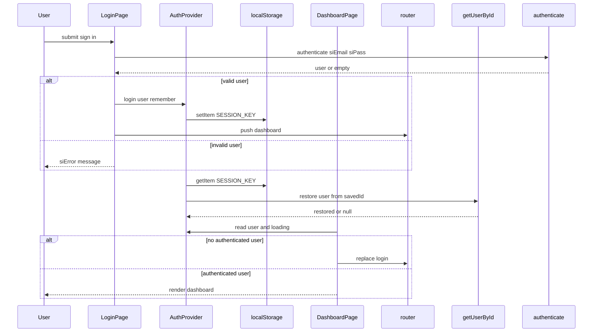

### Route-Local State That Drives Composition

| Location | State or value | Effect on routing or rendering |
| --- | --- | --- |
| `frontend/lib/AuthContext.jsx` | `user`, `loading`, `SESSION_KEY` | Restores and clears the shared session |
| `frontend/app/login/page.jsx` | `tab`, `siEmail`, `siPass`, `showSi`, `remember`, `siError`, `siLoading`, `suName`, `suEmail`, `suPass`, `showSu`, `suError`, `suSuccess` | Switches between sign-in and sign-up and controls form feedback |
| `frontend/app/dashboard/page.jsx` | `activeTab` | Chooses one of `DashboardTab`, `RoadmapTab`, `MentorTab`, or `AccountTab` through `TABS` |
| `frontend/app/dashboard/page.jsx` | `mobileOpen` | Opens and closes the mobile header menu in `DashboardHeader` |
| `frontend/components/shared/FooterGate.jsx` | `path`, `skip` | Hides `Footer` on selected routes |
| `frontend/components/dashboard/BottomNavBar.jsx` | `activeTab`, `setActiveTab` | Synchronizes the floating pill nav with the dashboard tab state |


### Dashboard Route Composition

*`frontend/app/dashboard/page.jsx`, `frontend/components/dashboard/BottomNavBar.jsx`*

The dashboard route is composed from a page-level tab controller and a tab bar. `TABS` maps `dashboard`, `roadmap`, `mentor`, and `account` to `DashboardTab`, `RoadmapTab`, `MentorTab`, and `AccountTab`. `DashboardPage` selects `ActiveComponent = TABS[activeTab]` and wraps the active panel in `AnimatePresence mode="wait"` so tab transitions animate cleanly.

`DashboardHeader` handles the top chrome and logout action, while `BottomNavBar` is the persistent route-local navigation. `BottomNavBar` uses `NAV_ITEMS` with the same four tab keys, so the header, main panel, and bottom nav all point at the same local state.

## Global Styling and Import Resolution

### Tailwind Bootstrap and Smooth Scrolling

*`frontend/app/globals.css`*

`globals.css` is the global stylesheet loaded by `frontend/app/layout.jsx`. It bootstraps Tailwind with `@tailwind base`, `@tailwind components`, and `@tailwind utilities`, then sets `html { scroll-behavior: smooth; }` so route jumps and in-page navigation move smoothly across the app.

### `@/*` Import Alias

*`frontend/jsconfig.json`*

`jsconfig.json` configures the project root as `baseUrl` and maps `@/*` to `./*`. That alias is used throughout the shell and route files, including imports such as `@/lib/AuthContext`, `@/components/shared/FooterGate`, `@/components/shared/Header`, and `@/components/YatraPricing`.

## Frontend Package Wiring

### Runtime and Build Metadata

*`frontend/package.json`*

| Field | Value |
| --- | --- |
| `name` | `yatra-frontend` |
| `version` | `0.1.0` |
| `private` | `true` |
| `scripts.dev` | `next dev -H 0.0.0.0` |
| `scripts.build` | `next build` |
| `scripts.start` | `next start` |


| Dependency group | Packages |
| --- | --- |
| Runtime | `next`, `react`, `react-dom`, `framer-motion`, `lucide-react`, `groq-sdk` |
| Dev | `tailwindcss`, `postcss`, `autoprefixer` |


`next` 16.2.6 is the app router runtime behind the pages in `frontend/app/`. `framer-motion` is used in the landing, features, login, dashboard, and pricing surfaces for entry animation and panel transitions, while `lucide-react` supplies the icon set used across route chrome and dashboard navigation.

## Route Composition Details

### Landing Page

*`frontend/app/page.jsx`*

`HomePage` builds the public landing experience. It imports `Header`, defines local helpers such as `Fade`, `Divider`, `glassMain`, `glassSub`, `CTAButton`, and `InstrumentCard`, and ends with a `Link` to `/login`. The page is visually self-contained, but it still inherits the global auth wrapper and footer gate from `RootLayout`.

### Features Page

*`frontend/app/features/page.jsx`*

`FeaturesPage` is a client page that composes `Header`, animated scenes, and CTA buttons. The local helpers `Fade`, `Grid`, `Scene`, `FeatureCards`, and `NeumorphicBtn` structure the page into narrative sections, and the page links users onward to `/login` and `/pricing`.

### Pricing Page

*`frontend/app/pricing/page.jsx`, `frontend/components/YatraPricing.jsx`*

`PricingPage` mounts `YatraPricing` underneath `Header`. `YatraPricing` contains its own internal state and interactive surfaces, but at the routing level the important detail is that the page entrypoint simply embeds the pricing experience inside the global shell.

### Login Page

*`frontend/app/login/page.jsx`*

`LoginPage` is explicitly marked `"use client"` because it reads and writes session state through `useAuth`. It imports `authenticate`, `registerUser`, and `TEST_USERS`, and it routes to `/dashboard` on success. This page is also one of the paths hidden by `FooterGate`, which keeps the auth screen uncluttered.

### Dashboard Page

*`frontend/app/dashboard/page.jsx`*

`DashboardPage` is also a client page because it needs `useAuth`, `useEffect`, `useRouter`, and animated UI state. Its top-level shape is: guard, loading spinner, null on no user, then the dashboard shell with `DashboardHeader`, the active tab component from `TABS`, and the floating `BottomNavBar`.

## Key Files Reference

| File | Responsibility |
| --- | --- |
| `frontend/app/layout.jsx` | Global shell that wraps all pages in `AuthProvider` and appends `FooterGate` |
| `frontend/lib/AuthContext.jsx` | Shared client-side auth session state and localStorage restore logic |
| `frontend/components/shared/FooterGate.jsx` | Path-aware footer suppression for login and dashboard routes |
| `frontend/app/page.jsx` | Public landing route entrypoint |
| `frontend/app/features/page.jsx` | Marketing features route entrypoint |
| `frontend/app/pricing/page.jsx` | Pricing route entrypoint |
| `frontend/app/login/page.jsx` | Sign-in and sign-up route entrypoint |
| `frontend/app/dashboard/page.jsx` | Auth-gated dashboard route entrypoint |
| `frontend/app/globals.css` | Tailwind bootstrap and smooth scrolling |
| `frontend/jsconfig.json` | `@/*` import alias configuration |
| `frontend/package.json` | Frontend scripts and package wiring |


---

## Authentication, Session State, and Demo User Model/Auth context lifecycle and remembered session behavior

# Authentication, Session State, and Demo User Model

*Relevant files: `docs/test-accounts.md`, `frontend/app/layout.jsx`, `frontend/lib/AuthContext.jsx`, `frontend/app/dashboard/page.jsx`*

## Overview

Yatra’s authentication layer is a client-side session container built around `frontend/lib/AuthContext.jsx`. It keeps the current demo user in React state, restores a remembered session from `localStorage`, and exposes a guarded `useAuth` hook for consumers that need access to the session.

The user experience is intentionally lightweight: when a remembered demo session exists, the app rehydrates the user from the saved demo user id and takes them straight into the dashboard. When no session exists, the dashboard page redirects to `/login` after auth state finishes loading. The same provider is mounted at the app root in `frontend/app/layout.jsx`, so all route segments can share the same session state.

## Session Provider Lifecycle

### `frontend/lib/AuthContext.jsx`

The remembered-session key is shared between the docs and the auth context: docs/test-accounts.md describes the “Remember me” behavior as persisting the session under yatra_session_uid, and frontend/lib/AuthContext.jsx uses the same SESSION_KEY value.

This file is the core of the demo auth flow. It creates the context, owns the session state, restores remembered sessions on mount, and defines the login and logout operations used by dashboard consumers.

#### Exported symbols

| Symbol | Role |
| --- | --- |
| `AuthContext` | React context created with `createContext(null)` |
| `SESSION_KEY` | `localStorage` key used for remembered sessions: `yatra_session_uid` |
| `AuthProvider` | Provider component that owns `user` and `loading` state |
| `useAuth` | Guarded hook that exposes the auth context to consumers |


#### Provider initialization and restoration

- `user` set to `null`
- `loading` set to `true`

On mount, it runs a `useEffect` that:

1. Reads `localStorage.getItem(SESSION_KEY)`.
2. Stores the raw stored value in `savedId`.
3. If `savedId` exists, calls `getUserById(savedId)`.
4. If that returns a demo user, stores the result in `restored` and calls `setUser(restored)`.
5. Always calls `setLoading(false)` in `finally`.

The restoration logic is wrapped in `try` / `catch` so browser storage access problems do not crash the app during server-side rendering or other environments where `localStorage` is unavailable.

#### Login and logout behavior

- `user`
- `login`
- `logout`
- `loading`

The functions behave as follows:

- `login(userObj, remember = true)`- Immediately calls `setUser(userObj)`.
- If `remember` is truthy, saves `userObj.id` to `localStorage` under `SESSION_KEY`.
- The default value of `remember` is `true`, so callers persist by default unless they opt out.

- `logout()`- Calls `setUser(null)`.
- Removes `SESSION_KEY` from `localStorage`.

#### `useAuth` guard

`useAuth()` reads the context with `useContext(AuthContext)`. If it is used outside `AuthProvider`, it throws:

- `useAuth must be used inside <AuthProvider>`

This makes the provider boundary explicit and prevents dashboard components from silently reading an undefined session.

## App Shell Wiring

### `frontend/app/layout.jsx`

`RootLayout({ children })` is the app-wide wrapper that mounts `AuthProvider` around the routed UI:

- `<AuthProvider>`- `{children}`
- `<FooterGate />`

This placement makes the same auth state available to the dashboard route, any other route that calls `useAuth`, and the route tree that is wrapped by the provider.

### `frontend/app/dashboard/page.jsx`

`DashboardPage()` is the route-level consumer that enforces the session gate.

It reads:

- `user`
- `loading`

from `useAuth()`, then uses `useRouter()` for navigation.

Its render and redirect behavior is:

1. While `loading` is `true`, it renders a centered spinner.
2. Once loading completes, if `user` is still missing, it runs `router.replace("/login")`.
3. If `user` is missing after loading, it returns `null` so the dashboard never flashes to unauthenticated users.
4. If `user` exists, it renders the dashboard shell, the active tab, and the floating navigation.

The dashboard header uses the same session state for the visible user label and logout action:

- `user?.name ?? "Explorer"`
- `logout(); router.push("/login")`

That means the header can both reflect the restored demo account and immediately clear the session when the user signs out.

## Remembered Session Behavior

### `docs/test-accounts.md`

The test-accounts document explicitly describes the demo persistence contract:

- The “Remember me” checkbox persists the session in `localStorage` under `yatra_session_uid`.

That aligns directly with `frontend/lib/AuthContext.jsx`, where:

- `SESSION_KEY` is `yatra_session_uid`
- the mount effect restores from the same key
- `login(userObj, remember = true)` writes the user id when remembered sessions are enabled
- `logout()` removes the same key

The practical effect is that a returning user lands back in the same demo account without re-entering credentials, as long as the key remains in browser storage.

## Dashboard Consumers of Auth State

The auth context is not just a gate; it also feeds user-specific UI after the session is restored.

### `frontend/app/dashboard/page.jsx`

- show the current user’s display name
- fall back to `Explorer` if the user is missing from the render path
- clear the session and navigate back to `/login` on logout

### `frontend/components/dashboard/DashboardTab.jsx`

This consumer reads `user` and derives dashboard metrics from the restored demo profile:

- `user?.name`
- `user?.progress`
- `user?.streak`
- `user?.skills`
- `user?.pearls`
- `user?.radarScores`

Those values drive the welcome message, progress bar, stat cards, and skill radar.

### `frontend/components/dashboard/AccountTab.jsx`

This consumer also reads the authenticated demo user for account display:

- `user?.name`
- `user?.subscription`
- `user?.memberSince`
- `user?.email`
- `user?.birthDate`
- `user?.goal`

It uses the same `logout()` behavior as the dashboard header and then pushes to `/login`.

## Session State and UI Gating

| State | Trigger | Visible behavior |
| --- | --- | --- |
| Loading | `AuthProvider` is still restoring from `localStorage` | Dashboard page shows the spinning loader |
| Authenticated | `user` is set after restore or login | Dashboard renders normally |
| Unauthenticated | `loading` is false and `user` is still `null` | Dashboard redirects to `/login` and returns `null` |
| Cleared session | `logout()` runs | `user` becomes `null` and `yatra_session_uid` is removed |


## Flow of Session Restore and Logout

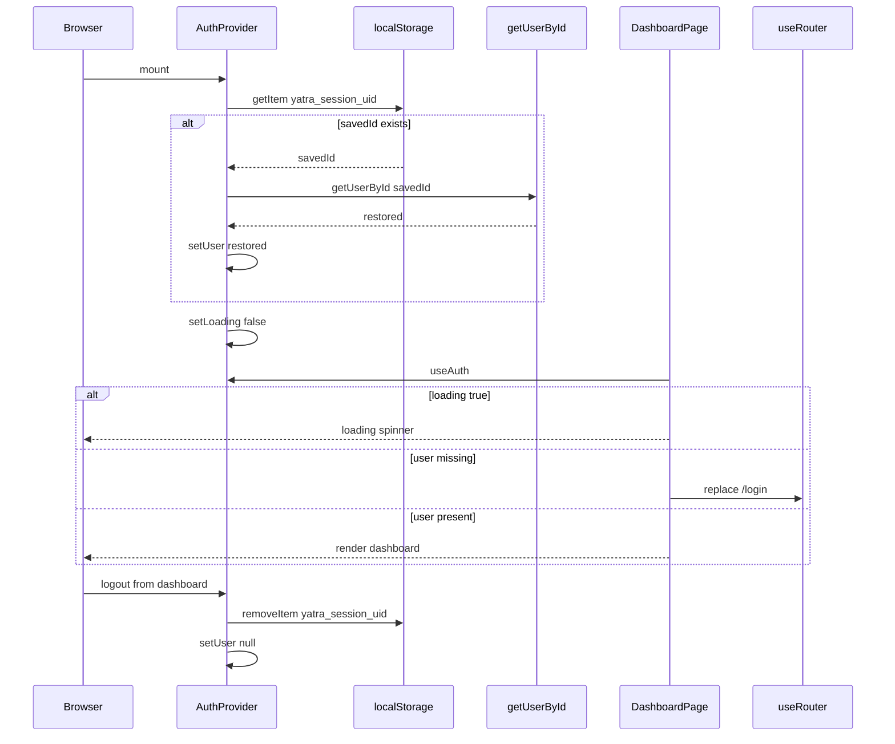

## Integration Points

- `frontend/app/layout.jsx` mounts `AuthProvider` at the app root.
- `frontend/app/dashboard/page.jsx` blocks dashboard rendering until auth state is resolved.
- `docs/test-accounts.md` documents the remembered-session key used by the demo flow.
- `frontend/components/dashboard/DashboardTab.jsx` and `frontend/components/dashboard/AccountTab.jsx` consume the restored user object after the session is available.

## Error Handling

`frontend/lib/AuthContext.jsx` handles browser storage failures in two places:

- during mount-time session restoration
- during `login()` writes
- during `logout()` removals

Those operations are wrapped in `try` blocks, and the mount effect always reaches `setLoading(false)` in `finally`, which keeps the dashboard from hanging in a perpetual loading state if storage access fails.

`useAuth()` also fails fast with an explicit error when it is called outside `AuthProvider`, which makes incorrect usage immediately visible during development.

## Dependencies

### `frontend/lib/AuthContext.jsx`

- `createContext`, `useContext`, `useState`, `useEffect` from `react`
- `getUserById` from `./users`

### `frontend/app/layout.jsx`

- `AuthProvider` from `@/lib/AuthContext`
- `FooterGate` from `@/components/shared/FooterGate`

### `frontend/app/dashboard/page.jsx`

- `useAuth` from `@/lib/AuthContext`
- `useRouter` from `next/navigation`

## Key Files Reference

| File | Responsibility |
| --- | --- |
| `docs/test-accounts.md` | Documents the demo “Remember me” behavior and the `yatra_session_uid` storage key |
| `frontend/app/layout.jsx` | Wraps the app in `AuthProvider` so session state is available across routes |
| `frontend/lib/AuthContext.jsx` | Owns session state, restoration, login, logout, and the `useAuth` guard |
| `frontend/app/dashboard/page.jsx` | Redirects unauthenticated users to `/login` and renders the dashboard only after auth resolves |


---

## Dashboard Experience and Internal Navigation/Dashboard page container, tab switching, and guarded entrypoint

# Dashboard Experience and Internal Navigation

*Primary scope: `frontend/app/dashboard/page.jsx` with the dashboard tab surface in `frontend/components/dashboard/`.*

## Overview

The dashboard entrypoint is a client-rendered shell that protects `/dashboard` behind local auth state, switches between four internal tabs, and keeps navigation visible while content changes. On first render, it waits for `useAuth()` to finish restoring session state; if no user is present after loading completes, it performs a client-side redirect to `/login`.

Once authenticated, the page renders a branded dashboard frame with a sticky header, animated tab content swaps, and a persistent floating bottom navigation bar. The active tab is stored locally as `activeTab`, and the page uses a `TABS` mapping to swap between `DashboardTab`, `RoadmapTab`, `MentorTab`, and `AccountTab` without leaving the route.

The dashboard surface also includes nested widgets used by the home tab and mentor tab, plus a separate `DashboardSidebar.jsx` source file that defines an alternate navigation layout. The active dashboard page does not wire that sidebar file directly.

## Dashboard Shell and Internal Navigation

### Guarded entrypoint

*File path: `frontend/app/dashboard/page.jsx`*

`DashboardPage` is the route entrypoint for `/dashboard`. It is a client component that:

- reads `user` and `loading` from `useAuth`
- creates `activeTab` state with the initial value `"dashboard"`
- redirects unauthenticated users to `/login` with `router.replace("/login")`
- returns a full-screen spinner while auth is still loading
- returns `null` when loading is complete and no user is available
- renders the dashboard shell only when `user` is present

#### Auth gate flow

- `loading === true`:- renders a centered rotating spinner on a `#DFE0BF` background
- `loading === false` and `user === null`:- `useEffect` triggers `router.replace("/login")`
- the component renders nothing
- `loading === false` and `user !== null`:- the dashboard shell renders normally

### Tab mapping

*File path: `frontend/app/dashboard/page.jsx`*

The page keeps tab switching declarative with a `TABS` map:

| Tab key | Component |
| --- | --- |
| `dashboard` | `DashboardTab` |
| `roadmap` | `RoadmapTab` |
| `mentor` | `MentorTab` |
| `account` | `AccountTab` |


`const ActiveComponent = TABS[activeTab]` is the only content switch used by the page. The current tab is preserved in local state, so switching tabs does not trigger a route change.

### Header composition

*File path: `frontend/app/dashboard/page.jsx`*

`DashboardHeader()` provides the page-level navigation chrome.

| Piece | Responsibility |
| --- | --- |
| Logo link | `Link href="/"` returns to the public home page |
| Desktop nav | Renders `NAV_LINKS` for `"/features"` and `"/pricing"` |
| User chip | Displays `user?.name ?? "Explorer"` |
| Logout button | Calls `logout()` and then `router.push("/login")` |
| Mobile menu toggle | Uses `Menu` and `X` to open and close the dropdown |
| Mobile dropdown | Repeats the `NAV_LINKS` list and shows the user plan line |


`NAV_LINKS` contains:

| Label | href |
| --- | --- |
| `Features` | `/features` |
| `Pricing` | `/pricing` |


### Persistent bottom navigation

*File path: `frontend/components/dashboard/BottomNavBar.jsx`*

`BottomNavBar` stays fixed at the bottom of the viewport and is always visible on the dashboard route. It receives the active tab from the page and updates the page state through `setActiveTab`.

| Prop | Responsibility |
| --- | --- |
| `activeTab` | Marks the currently selected tab |
| `setActiveTab` | Updates the page-level tab state |


Its `NAV_ITEMS` array maps the four dashboard sections to icon buttons:

| Label | tab |
| --- | --- |
| `Dashboard` | `dashboard` |
| `Roadmap` | `roadmap` |
| `Mentor` | `mentor` |
| `Account` | `account` |


The active button changes background and label width, and the inactive labels collapse to zero width. The component also sets `aria-current="page"` on the active item.

### Animated content swaps

*File path: `frontend/app/dashboard/page.jsx`*

The page wraps the active tab in `AnimatePresence mode="wait"` and a keyed `motion.div`:

- `key={activeTab}` forces a re-entry animation on each tab change
- the content fades and slides between states
- the transition is used for every tab swap, not only the dashboard home tab

This makes the dashboard feel like a single persistent workspace instead of a set of isolated pages.

## Runtime Auth and Layout Integration

### Session source

*File path: `frontend/lib/AuthContext.jsx`*

The dashboard gate depends on the global auth provider. `AuthProvider` restores the session from `localStorage` using `SESSION_KEY = "yatra_session_uid"` and exposes:

| Value | Responsibility |
| --- | --- |
| `user` | Current session user |
| `loading` | Restore state for auth bootstrap |
| `login` | Stores the user and persists the session id |
| `logout` | Clears the current user and removes the session id |


`DashboardPage` and `DashboardHeader` both consume `useAuth()`.

### Route-level wrapper

*File path: `frontend/app/layout.jsx`*

`RootLayout` wraps the app in `AuthProvider`. The same layout also includes `FooterGate`, which hides the shared footer on `/dashboard`, keeping the dashboard surface visually isolated from the public site footer.

## Dashboard Surface Files

### Runtime-wired dashboard surface

The dashboard page directly wires the following files:

| File | Role in the dashboard shell |
| --- | --- |
| `frontend/app/dashboard/page.jsx` | Guarded dashboard entrypoint, header, active tab state, animated content swaps |
| `frontend/components/dashboard/BottomNavBar.jsx` | Persistent bottom navigation |
| `frontend/components/dashboard/DashboardTab.jsx` | Home tab content |
| `frontend/components/dashboard/RoadmapTab.jsx` | Roadmap tab content |
| `frontend/components/dashboard/MentorTab.jsx` | Mentor tab content |
| `frontend/components/dashboard/AccountTab.jsx` | Account tab content |
| `frontend/components/dashboard/TentacleGrab.jsx` | Home tab widget |
| `frontend/components/dashboard/SkillRadar.jsx` | Home tab widget |
| `frontend/components/dashboard/SmallWins.jsx` | Home tab widget |
| `frontend/components/dashboard/ResumeAnalyzer.jsx` | Mentor tab widget |


### Additional dashboard source evidence

`frontend/components/dashboard/DashboardSidebar.jsx` is present in the repository as a dashboard navigation source file. It defines its own desktop sidebar and mobile bottom navigation, but the active dashboard page does not import it, so it should be treated as isolated source evidence unless runtime wiring is found elsewhere.

## Component Details

### `frontend/app/dashboard/page.jsx`

*File path: `frontend/app/dashboard/page.jsx`*

This file is the dashboard entrypoint and shell controller.

| Item | Responsibility |
| --- | --- |
| `TABS` | Maps tab keys to tab components |
| `NAV_LINKS` | Defines header links to `"/features"` and `"/pricing"` |
| `DashboardHeader` | Page-specific sticky header |
| `handleLogout` | Calls `logout()` and redirects to `"/login"` |
| `router` | Handles redirect and logout navigation |


Key runtime behavior:

- auth loading spinner while `useAuth()` is restoring state
- client-side redirect to `/login` when unauthenticated
- `activeTab` starts at `"dashboard"`
- selected tab content swaps with animation
- `BottomNavBar` remains persistent across tab changes

### `frontend/components/dashboard/BottomNavBar.jsx`

*File path: `frontend/components/dashboard/BottomNavBar.jsx`*

This component provides the persistent mobile-first dashboard navigation.

| Prop | Responsibility |
| --- | --- |
| `activeTab` | Drives active state styling |
| `setActiveTab` | Switches tabs in the page shell |


Notable behavior:

- fixed positioning above the viewport bottom
- rounded pill container
- animated label expansion for the active tab
- icon-only collapsed state for inactive tabs
- `aria-label` on each button and `aria-current` on the active tab

### `frontend/components/dashboard/DashboardTab.jsx`

*File path: `frontend/components/dashboard/DashboardTab.jsx`*

This is the default landing tab shown when the dashboard opens.

| Prop | Responsibility |
| --- | --- |
| none declared | The component reads session data from `useAuth()` |


- `TentacleGrab`
- `SkillRadar`
- `SmallWins`

It also uses local helper components and constants:

| Symbol | Responsibility |
| --- | --- |
| `glass` | Shared glassmorphism style object |
| `Fade` | Motion wrapper for staggered entrances |
| `ProgressBar` | Renders progress state |
| `StatCard` | Displays the streak, skills, and pearls counters |


### `frontend/components/dashboard/AccountTab.jsx`

*File path: `frontend/components/dashboard/AccountTab.jsx`*

This file defines the account tab that appears in the dashboard shell.

| Prop | Responsibility |
| --- | --- |
| none declared | Reads `user`, `logout`, and `router` through hooks |


Local helpers and stateful pieces include:

| Symbol | Responsibility |
| --- | --- |
| `SUBSCRIPTION_COLORS` | Color palette for `Explorer`, `Navigator`, and `Captain` |
| `glass` | Card styling |
| `inputStyle` | Password form input styling |
| `InfoRow` | Renders one profile data row |
| `PasswordReset` | Expandable password form |


The tab includes:

- account summary and subscription badge
- profile detail rows
- logout action
- expandable password reset form
- a `Delete account` action label in the danger zone area

### `frontend/components/dashboard/RoadmapTab.jsx`

*File path: `frontend/components/dashboard/RoadmapTab.jsx`*

This tab is the roadmap placeholder in the dashboard shell. It presents the roadmap space and a `Start Analysis` call to action, but the page-level navigation still treats it as a tab in the shell.

| Prop | Responsibility |
| --- | --- |
| none declared | Pure visual tab content |


### `frontend/components/dashboard/MentorTab.jsx`

*File path: `frontend/components/dashboard/MentorTab.jsx`*

This tab is the AI mentor entry inside the dashboard shell.

| Prop | Responsibility |
| --- | --- |
| none declared | Pure visual tab content controlled by local `view` state |


Visible local structure:

| Symbol | Responsibility |
| --- | --- |
| `glass` | Shared glass card style |
| `SYSTEM_PROMPT` | Mentor behavior prompt text |
| `Bubble` | Message bubble rendering |
| `TypingDots` | Typing indicator |
| `MentorChat` | Chat view |
| `view` | Toggles between `chat` and `resume` |
| `ResumeAnalyzer` | Embedded resume-analysis mode |


This tab keeps its own internal view toggle, but the dashboard shell only sees it as one of the four `TABS` entries.

### `frontend/components/dashboard/TentacleGrab.jsx`

*File path: `frontend/components/dashboard/TentacleGrab.jsx`*

This widget is embedded inside `DashboardTab`.

| Prop | Responsibility |
| --- | --- |
| none declared | Self-contained widget |


Visible local state and behavior:

| Symbol | Responsibility |
| --- | --- |
| `glass` | Card styling |
| `url` | Input value |
| `grabbed` | Temporary success state |
| `handleGrab` | Sets the success state when a URL is entered |


The widget provides:

- a URL field for GitHub or LinkedIn
- a `Grab It` action
- alternate import buttons for `Upload PDF`, `GitHub Sync`, and `LinkedIn`
- a short mentor whisper message at the bottom

### `frontend/components/dashboard/SkillRadar.jsx`

*File path: `frontend/components/dashboard/SkillRadar.jsx`*

This widget renders the dashboard skill radar.

| Prop | Responsibility |
| --- | --- |
| `scores` | Optional skill-score source used instead of the default skill set |


Visible constants and helpers:

| Symbol | Responsibility |
| --- | --- |
| `DEFAULT_SKILLS` | Fallback radar categories |
| `SIZE` | SVG canvas size |
| `CENTER` | SVG center point |
| `RINGS` | Concentric ring levels |
| `LEVELS` | Radar level count |
| `polarToXY` | Converts polar coordinates to XY coordinates |
| `buildPolygon` | Builds the filled radar polygon |


If `scores` is passed, the component derives labels and values from `Object.entries(scores)`; otherwise it uses `DEFAULT_SKILLS`.

### `frontend/components/dashboard/SmallWins.jsx`

*File path: `frontend/components/dashboard/SmallWins.jsx`*

This widget renders the dashboard’s recent wins list.

| Prop | Responsibility |
| --- | --- |
| none declared | Self-contained list renderer |


Visible local data:

| Symbol | Responsibility |
| --- | --- |
| `WINS` | Static win entries shown in the list |


Each win item carries `emoji`, `title`, `desc`, `date`, and `color`.

### `frontend/components/dashboard/ResumeAnalyzer.jsx`

*File path: `frontend/components/dashboard/ResumeAnalyzer.jsx`*

This widget is used by `MentorTab` and provides resume analysis UI.

| Prop | Responsibility |
| --- | --- |
| none declared | Self-contained analyzer component |


Visible local helpers and state:

| Symbol | Responsibility |
| --- | --- |
| `glass` | Shared card styling |
| `LEVEL_COLOR` | Color mapping for skill levels |
| `MiniRadar` | Compact radar chart renderer |
| `ScoreRing` | Circular score indicator |
| `SkillPill` | Expandable skill label |
| `ListSection` | Bullet list section |
| `text` | Raw resume text input |
| `loading` | Analysis submission state |
| `report` | Returned analysis data |
| `error` | Error message string |
| `fileRef` | File input ref |


This component issues an internal `fetch` call to `/api/groq/resume` from the mentor workflow, but that API is not documented here because no verified endpoint contract was extracted.

### `frontend/components/dashboard/DashboardSidebar.jsx`

*File path: `frontend/components/dashboard/DashboardSidebar.jsx`*

This file is source evidence for an alternate dashboard navigation implementation.

| Prop | Responsibility |
| --- | --- |
| `activeTab` | Marks the selected item |
| `setActiveTab` | Updates the selected tab |


Visible local data:

| Symbol | Responsibility |
| --- | --- |
| `NAV` | Sidebar tab definitions |
| `USER` | Mock profile card data |
| `active` | Active state flag inside the nav map |


The file defines:

- a desktop sidebar
- a mobile bottom nav
- a profile card using `/assets/3d_prof_anf.png`

## State and UI Behavior

### Page-level state

frontend/components/dashboard/DashboardSidebar.jsx is present as dashboard navigation source evidence, but frontend/app/dashboard/page.jsx currently wires BottomNavBar into the live dashboard shell. This documentation treats the sidebar file as isolated evidence, not as the active runtime navigation source.

*File path: `frontend/app/dashboard/page.jsx`*

| State | Responsibility |
| --- | --- |
| `activeTab` | Controls which dashboard component is rendered |
| `mobileOpen` | Controls the header’s mobile dropdown |
| `loading` | Controls the auth bootstrap spinner |
| `user` | Controls whether the dashboard shell renders |


### User-visible states

| State | What the user sees |
| --- | --- |
| Loading | Full-screen spinner centered on the page |
| Unauthenticated | Client-side redirect to `/login` |
| Authenticated | Header, content area, and persistent bottom nav |
| Mobile header open | Expanded dropdown with nav links and logout |
| Tab switch | Animated replacement of the active tab content |


### Tab switch behavior

1. user taps a bottom nav item
2. `BottomNavBar` calls `setActiveTab(tab)`
3. `DashboardPage` resolves `TABS[activeTab]`
4. keyed `motion.div` exits the current tab
5. the new component mounts with entrance animation

## Feature Flow

### Guarded entrypoint and tab switching

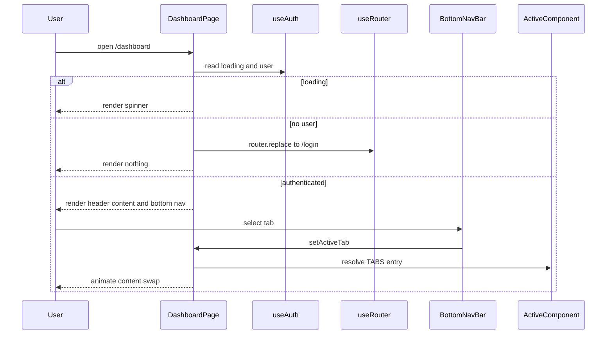

## Integration Points

- `frontend/lib/AuthContext.jsx` supplies the local auth state used by the dashboard gate.
- `frontend/app/layout.jsx` wraps the app in `AuthProvider`, which makes the dashboard guard possible.
- `frontend/app/layout.jsx` also includes `FooterGate`, and `/dashboard` is one of the hidden paths.
- `frontend/components/dashboard/BottomNavBar.jsx` is the active persistent navigation source.
- `frontend/components/dashboard/DashboardSidebar.jsx` exists as alternate navigation source evidence.
- `frontend/components/dashboard/DashboardTab.jsx`, `MentorTab.jsx`, and `AccountTab.jsx` are the four shell destinations exposed by `TABS`.

## Error Handling

The dashboard shell uses direct UI control flow rather than a separate error boundary:

- loading state renders a spinner while session restoration is in progress
- unauthenticated state redirects to `/login`
- `DashboardHeader` logout clears the session and navigates away immediately
- `DashboardPage` returns `null` if auth is absent after loading completes

The tab content itself handles its own local errors or loading states inside the corresponding tab components, but those behaviors stay inside their own modules.

## Dependencies

### Page shell dependencies

*File path: `frontend/app/dashboard/page.jsx`*

- `useState`
- `useEffect`
- `Link`
- `useRouter`
- `motion`
- `AnimatePresence`
- `Menu`
- `X`
- `useAuth`
- `BottomNavBar`
- `DashboardTab`
- `RoadmapTab`
- `MentorTab`
- `AccountTab`

### Dashboard component dependencies

Across `frontend/components/dashboard/`, the dashboard surface uses:

- `motion`
- `AnimatePresence`
- `next/image`
- `next/navigation`
- `lucide-react`
- `useAuth`

## Key Files Reference

| File | Responsibility |
| --- | --- |
| `frontend/app/dashboard/page.jsx` | Dashboard entrypoint, auth gating, header, active tab state, animated swaps |
| `frontend/components/dashboard/BottomNavBar.jsx` | Persistent bottom navigation |
| `frontend/components/dashboard/DashboardTab.jsx` | Default dashboard tab shell |
| `frontend/components/dashboard/RoadmapTab.jsx` | Roadmap tab shell |
| `frontend/components/dashboard/MentorTab.jsx` | Mentor tab shell |
| `frontend/components/dashboard/AccountTab.jsx` | Account tab shell |
| `frontend/components/dashboard/TentacleGrab.jsx` | Dashboard home widget |
| `frontend/components/dashboard/SkillRadar.jsx` | Dashboard home widget |
| `frontend/components/dashboard/SmallWins.jsx` | Dashboard home widget |
| `frontend/components/dashboard/ResumeAnalyzer.jsx` | Mentor tab analysis widget |
| `frontend/components/dashboard/DashboardSidebar.jsx` | Alternate dashboard navigation source evidence |


---

## Product Architecture and Request Flow/AI-assisted product boundaries between UI, Next route handlers, and backend stub

# Product Architecture and Request Flow

*`frontend/app/`, `frontend/components/`, `frontend/app/api/`, `frontend/lib/AuthContext.jsx`, `backend/main.py`, `backend/requirements.txt`*

## Overview

Yatra splits the user experience into three clear boundaries: client-rendered Next.js pages and components, server-side Next route handlers that normalize AI requests and responses, and a separate minimal Python FastAPI stub. The browser-facing UI keeps most interaction state locally, including chat transcripts, roadmap previews, resume analysis results, and the signed-in session.

The AI paths are intentionally narrow. The Next.js route handlers in `frontend/app/api/` are the only server-side step used by the browser for chat, roadmap generation, and resume analysis, while `backend/main.py` currently exposes only a root health-style response. That keeps the visible product flow simple: local UI state first, server normalization second, upstream AI provider last.

## Request Boundary Map

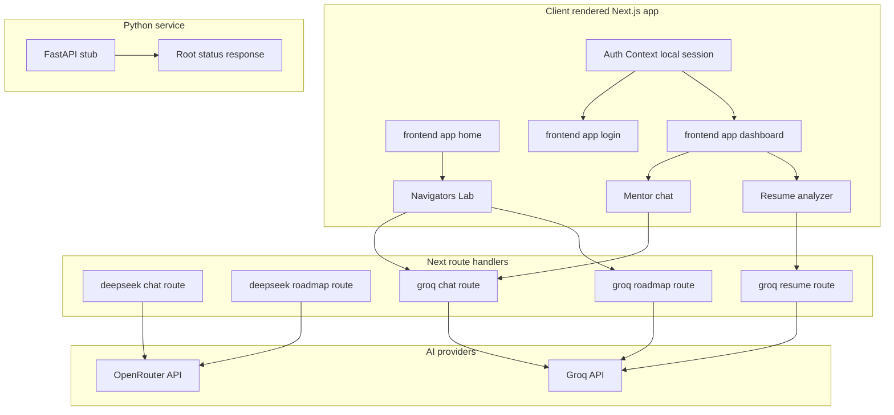

## Client State and Session Boundary

frontend/components/dashboard/MentorTab.jsx includes systemPrompt in its POST body for /api/groq/chat, but frontend/app/api/groq/chat/route.js ignores that field and uses its own hard-coded SYSTEM_PROMPT. The request body field does not affect the server response.

The client owns the interactive state until a request is sent. Session data is restored from `localStorage` in `frontend/lib/AuthContext.jsx`, while the page shells in `frontend/app/login/page.jsx` and `frontend/app/dashboard/page.jsx` redirect or render based on that local session state.

| File | Local state | Boundary behavior |
| --- | --- | --- |
| `frontend/lib/AuthContext.jsx` | `user`, `loading`, `SESSION_KEY = "yatra_session_uid"` | Restores the session from `localStorage`, exposes `login` and `logout`, and keeps the session entirely client-side. |
| `frontend/app/login/page.jsx` | `tab`, `siEmail`, `siPass`, `remember`, `siError`, `siLoading`, `suName`, `suEmail`, `suPass`, `suError`, `suSuccess` | Uses local auth helpers, then routes to `/dashboard`; no AI route is involved. |
| `frontend/app/dashboard/page.jsx` | `activeTab` | Chooses `DashboardTab`, `RoadmapTab`, `MentorTab`, or `AccountTab` locally after auth checks. |
| `frontend/components/YatraPricing.jsx` | `activeTab`, `goal`, `roadmap`, `chat`, `userInput`, `loading`, `scrollRef` | Posts to `/api/groq/chat` and `/api/groq/roadmap`, then stores the returned data in component state. |
| `frontend/components/dashboard/MentorTab.jsx` | `view`, `messages`, `input`, `loading`, `bottomRef` | Posts to `/api/groq/chat`, then appends the assistant reply to the local message list. |
| `frontend/components/dashboard/ResumeAnalyzer.jsx` | `text`, `loading`, `report`, `error`, `fileRef` | Posts to `/api/groq/resume`, then stores the structured report locally. |


### Auth Context and Local Session

*`frontend/lib/AuthContext.jsx`*

`AuthProvider` restores the signed-in user from `localStorage` on mount and exposes `user`, `login`, `logout`, and `loading` through context. `login` writes `userObj.id` to `localStorage` only when the `remember` flag is true, and `logout` clears `SESSION_KEY`.

`useAuth` is a strict consumer helper: it throws if it is used outside `AuthProvider`. That makes the session boundary explicit in every component that depends on it, including the login page and dashboard page.

## Next.js AI Route Handler Contracts

The Next.js API routes are the server-side boundary that converts the UI’s simple request shapes into provider-specific payloads. Two handlers call OpenRouter directly through `fetch`, and three handlers use `groq-sdk`; all five normalize the AI result into JSON that the client can safely store.

| File | Route pattern | Input from UI | Success payload | Upstream behavior | Error behavior |
| --- | --- | --- | --- | --- | --- |
| `frontend/app/api/deepseek/chat/route.js` | `/api/deepseek/chat` | `userMessage`, `chatHistory` | `{ text }` | Calls OpenRouter chat completions with `google/gemma-4-26b-a4b-it:free` and `temperature: 0.7`. | Returns `400` for missing `userMessage`, upstream status on OpenRouter failure, or `500` on catch. |
| `frontend/app/api/deepseek/roadmap/route.js` | `/api/deepseek/roadmap` | `goal` | `{ roadmap }` | Calls OpenRouter chat completions with `google/gemma-4-26b-a4b-it:free`, `temperature: 0.4`, then strips code fences and parses JSON. | Returns `400` for missing `goal`, upstream status on OpenRouter failure, or `500` for parse or catch failures. |
| `frontend/app/api/groq/chat/route.js` | `/api/groq/chat` | `userMessage`, `chatHistory` | `{ text }` | Calls `groq.chat.completions.create` with `llama-3.3-70b-versatile`, `temperature: 0.7`, and `max_completion_tokens: 512`. | Returns `400` for missing `userMessage` or `500` on catch. |
| `frontend/app/api/groq/resume/route.js` | `/api/groq/resume` | `resumeText` | `{ report }` | Calls `groq.chat.completions.create` with `llama-3.3-70b-versatile`, `temperature: 0.3`, `max_completion_tokens: 2048`, and slices `resumeText` to 8000 characters. | Returns `400` when the text is missing or shorter than 50 characters, `500` for JSON parse failures, or `500` on catch. |
| `frontend/app/api/groq/roadmap/route.js` | `/api/groq/roadmap` | `goal` | `{ roadmap }` | Calls `groq.chat.completions.create` with `llama-3.3-70b-versatile`, `temperature: 0.4`, `max_completion_tokens: 1024`, and `stream: false`, then strips code fences and parses JSON. | Returns `400` for missing `goal`, `500` for JSON parse failures, or `500` on catch. |


### Deepseek Chat Route

*`frontend/app/api/deepseek/chat/route.js`*

This handler accepts `userMessage` and optional `chatHistory`, rejects requests where `userMessage` is missing or not a string, and converts the local `{ role, text }` history into the provider format `{ role, content }`. It sends the prompt to OpenRouter with `HTTP-Referer`, `X-Title`, and `Authorization` headers, then returns `{ text }` from the first choice’s message content.

The response is a text-first chat contract. When OpenRouter returns a non-OK status, the handler surfaces the upstream error message when available, otherwise it falls back to `Sea storm detected.`

### Deepseek Roadmap Route

*`frontend/app/api/deepseek/roadmap/route.js`*

This handler validates `goal`, asks OpenRouter for a JSON-only roadmap, and then removes surrounding code fences before calling `JSON.parse`. The server wraps the parsed object as `{ roadmap }`, so the browser receives a structured object rather than free-form text.

The roadmap prompt requires `roadmapTitle` and a `waves` array with four weekly entries. If the model returns malformed JSON, the handler logs the raw payload and answers with `Could not parse roadmap from AI response.` and a `500` status.

### Groq Chat Route

*`frontend/app/api/groq/chat/route.js`*

This route performs the same chat-history translation as the deepseek chat route, but it uses the Groq SDK instead of direct `fetch`. The server returns `{ text }` and keeps the interaction stateless between requests; the browser is responsible for storing the conversation history it wants to resend.

The model call uses `llama-3.3-70b-versatile` with `temperature: 0.7` and `max_completion_tokens: 512`. On failure, it logs `Groq chat error:` and returns `The currents are too strong. Try again.` with status `500`.

### Groq Resume Route

*`frontend/app/api/groq/resume/route.js`*

This route is the most structured of the AI handlers. It requires `resumeText` to be a string with at least 50 characters, truncates the payload to the first 8000 characters, and asks Groq for a strict JSON report.

The response is wrapped as `{ report }`. The report payload is shaped as follows:

| Field | Shape |
| --- | --- |
| `report.name` | string |
| `report.targetRole` | string |
| `report.overallScore` | integer |
| `report.scoreLabel` | string |
| `report.summary` | string |
| `report.hardSkills` | array of objects with `name`, `level`, `note` |
| `report.softSkills` | array of objects with `name`, `level`, `note` |
| `report.strengths` | string array |
| `report.weaknesses` | string array |
| `report.gaps` | string array |
| `report.quickWins` | string array |
| `report.radarScores.Frontend` | number |
| `report.radarScores.Backend` | number |
| `report.radarScores.Logic` | number |
| `report.radarScores.Design` | number |
| `report.radarScores.SoftSkills` | number |


The handler strips code fences before parsing and returns `Could not parse analysis. Please try again.` when the model output is not valid JSON.

### Groq Roadmap Route

*`frontend/app/api/groq/roadmap/route.js`*

This route mirrors the roadmap behavior from the deepseek namespace, but it uses the Groq SDK and a separate model call. It requests a JSON-only 30-day roadmap, strips code fences, parses the payload, and wraps the result as `{ roadmap }`.

The returned roadmap object follows the same pattern used by the OpenRouter version: a `roadmapTitle` string and a `waves` array where each entry contains `week`, `theme`, and `milestones`. The client receives a clean JSON object instead of model prose.

### UI Callers That Trigger the AI Routes

*`frontend/components/YatraPricing.jsx`*

`chatWithGuide` posts `userMessage` and `chatHistory` to `/api/groq/chat`. `generateAIRoadmap` posts `goal` to `/api/groq/roadmap`. Both calls set `Content-Type: application/json`, parse the JSON response, and keep the resulting text or roadmap in local component state.

*`frontend/components/dashboard/MentorTab.jsx`*

`MentorChat` keeps the conversation in local state, maps assistant messages to `model` before sending, and posts `userMessage`, `chatHistory`, and `systemPrompt` to `/api/groq/chat`. The returned `{ text }` value is appended as the next assistant message.

*`frontend/components/dashboard/ResumeAnalyzer.jsx`*

`handleAnalyse` validates the input length before posting `{ resumeText: text }` to `/api/groq/resume`. It resets the current report, shows loading state, and stores the returned `{ report }` object on success.

*`frontend/app/login/page.jsx`*

The login page does not call an AI route. It uses local authentication helpers, then navigates to `/dashboard` after `login(user, remember)` succeeds.

## Request Flow Example

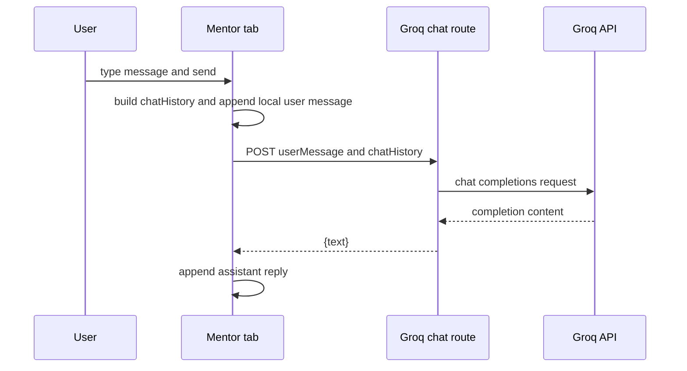

The browser keeps the conversation state, and the server only handles one request at a time. That pattern is the same for roadmap generation and resume analysis: the client posts a small JSON body, the route handler normalizes the upstream response, and the component stores the result locally.

## Backend Stub

The Python service is isolated from the Next.js AI flow. In the provided source, it exposes only a root route that returns a simple JSON status message.

### `backend/main.py`

*`backend/main.py`*

| Symbol | Role |
| --- | --- |
| `app = FastAPI()` | Creates the FastAPI application instance. |
| `@app.get("/")` | Registers the only visible HTTP endpoint. |
| `read_root` | Returns the root JSON payload. |


#### Read Root

```api
{
    "title": "Read Root",
    "description": "Returns the backend status message from the FastAPI stub",
    "method": "GET",
    "baseUrl": "http://localhost:8000",
    "endpoint": "/",
    "headers": [],
    "queryParams": [],
    "pathParams": [],
    "bodyType": "none",
    "requestBody": "",
    "formData": [],
    "rawBody": "",
    "responses": {
        "200": {
            "description": "Success",
            "body": "{\n    \"message\": \"Yatra Backend Running\"\n}"
        }
    }
}
```

`read_root` returns `{"message": "Yatra Backend Running"}` directly, so the backend stub currently functions as a minimal readiness endpoint rather than a data API.

### `backend/requirements.txt`

*`backend/requirements.txt`*

| Package | Version | Role in the backend stub |
| --- | --- | --- |
| `fastapi` | `0.115.5` | ASGI application framework for `backend/main.py`. |
| `uvicorn[standard]` | `0.32.1` | Local ASGI server dependency. |
| `pydantic` | `2.10.3` | Validation library available to the Python service. |
| `sqlalchemy` | `2.0.36` | Database toolkit dependency present in the backend environment. |


## Dependencies and Integration Points

| Layer | Dependency or integration | How it participates in this boundary |
| --- | --- | --- |
| Client session | `localStorage` | Stores the `yatra_session_uid` session id used by `AuthProvider`. |
| Client routing | `useRouter` from `next/navigation` | Redirects after login and enforces the dashboard gate. |
| Client requests | `fetch` | Used by `frontend/components/YatraPricing.jsx` and `frontend/components/dashboard/ResumeAnalyzer.jsx` to call Next routes. |
| Next responses | `NextResponse` from `next/server` | Standard JSON response wrapper for all five route handlers. |
| OpenRouter upstream | `https://openrouter.ai/api/v1/chat/completions` | Used by the deepseek-namespaced handlers. |
| Groq upstream | `groq-sdk` | Used by the groq-namespaced handlers. |
| Python service | `FastAPI` | Exposes the independent `GET /` root response. |


The visible integration points stay narrow: the browser talks to Next route handlers, those handlers talk to AI providers, and the FastAPI stub remains a separate service with its own root response.

---

## Authentication, Session State, and Demo User Model/Demo user store and local persistence model

# Authentication, Session State, and Demo User Model

This section documents the in-browser user repository that powers Yatra’s demo authentication flow and profile-backed dashboard state. The store lives in `frontend/lib/users.js` and starts from three seeded demo users, then reads and writes additional users in browser `localStorage` under `yatra_users`.

The repository is designed for a local, client-side demo experience: sign-in can authenticate against the seeded accounts, session restore can look users up by id, and profile fields such as `progress`, `streak`, `pearls`, `subscription`, and `radarScores` are preserved so the dashboard can render personalized progress and skill visuals. The intended demo-account workflow is described in `docs/test-accounts.md`, which pairs these stored credentials with the Sign In page and the remembered-session key `yatra_session_uid`.

## Demo User Repository

*File: `frontend/lib/users.js`*

`frontend/lib/users.js` is a small JavaScript user repository with module-scoped state. It keeps the working set in `users`, seeds that state from `DEFAULT_USERS`, and syncs browser-side persistence through the `yatra_users` storage key.

| Identifier | Kind | Role |
| --- | --- | --- |
| `STORAGE_KEY` | constant | `localStorage` key used for the user repository: `yatra_users` |
| `DEFAULT_USERS` | array | Seeded demo users that ship with the app |
| `users` | mutable array | Current in-memory repository state |
| `TEST_USERS` | export alias | Direct alias of `DEFAULT_USERS` for demo UI use |


`TEST_USERS` points at the same array as `DEFAULT_USERS`, so the demo list and the seed repository are the same data.

### Seeded demo accounts

The repository starts with three demo profiles:

| id | name | email | subscription | progress | streak | pearls | avatar |
| --- | --- | --- | --- | --- | --- | --- | --- |
| `usr_001` | Arjun Sharma | `arjun.sharma@gmail.com` | Explorer | 45 | 12 | 8 | `/assets/3d_prof_anf.png` |
| `usr_002` | Priya Nair | `priya.nair@gmail.com` | Navigator | 68 | 21 | 14 | `/assets/3d_prof_anf_binocular.png` |
| `usr_003` | Rohan Mehta | `rohan.mehta@gmail.com` | Captain | 82 | 34 | 23 | `/assets/ai_bot_octo.png` |


These records also carry `goal`, `bio`, `memberSince`, `skills`, and `radarScores`, which the dashboard can reuse for profile text, counters, and the Skill Radar visualization.

## User Record Shape

The repository stores each user as a plain object. The fields below are visible in the seed records and in the object created by `registerUser`.

| Field | Type | How it is used |
| --- | --- | --- |
| `id` | `string` | Stable user identifier; also used by `getUserById` and session restore |
| `name` | `string` | Display name in the demo profile and login workflow |
| `email` | `string` | Sign-in lookup key and uniqueness check |
| `password` | `string` | Authentication secret stored in the repository |
| `birthDate` | `string` | Profile date-of-birth field |
| `goal` | `string` | Career goal text shown in the profile experience |
| `bio` | `string` | Short profile tagline |
| `subscription` | `string` | Plan label such as Explorer, Navigator, or Captain |
| `memberSince` | `string` | Human-readable join date |
| `avatar` | `string` | Profile image asset path |
| `progress` | `number` | Dashboard progress indicator |
| `streak` | `number` | Streak counter shown in the dashboard experience |
| `skills` | `number` | Numeric skill count |
| `pearls` | `number` | Reward-style counter surfaced in the profile and dashboard |
| `radarScores` | `object` | Skill Radar input with `Frontend`, `Backend`, `Logic`, `Design`, and `SoftSkills` numeric scores |


`radarScores` is especially important because `docs/test-accounts.md` calls out that each account has unique scores, so the Dashboard tab renders different radar shapes per user.

## Persistence and Session Model

`frontend/lib/users.js` separates two concerns:

- `yatra_users` stores the repository of user records.
- `yatra_session_uid` is described in `docs/test-accounts.md` as the remember-me session key used by the demo auth flow.

The repository functions manage `yatra_users` only. Session restore is supported by `getUserById`, which is explicitly commented as being for session restore.

### Persistence behavior

- `loadUsers()` runs before every lookup or mutation.
- On the client, it reads `localStorage.getItem(STORAGE_KEY)`.
- If the stored value parses into a non-empty array, that array replaces the in-memory `users` state.
- If parsing fails, the store resets to `DEFAULT_USERS.slice()`.
- `saveUsers()` writes the current `users` array back to `localStorage` using `JSON.stringify`.

## Demo Account Workflow

> **Note:** `docs/test-accounts.md` describes the sign-up experience as demo-only and says new accounts are not actually persisted, but `registerUser` in `frontend/lib/users.js` does append a new user to `users` and writes the updated array to `localStorage` under `yatra_users`. The documentation describes the demo flow, while the repository module implements local persistence for registered users.

*File: `docs/test-accounts.md`*

The demo-account guide describes how the repository is intended to be used from the Sign In page:

- Use the listed email and password pairs to explore the dashboard.
- Click an account row on the login page to auto-fill the fields.
- The remember-me checkbox persists the session in `localStorage` under `yatra_session_uid`.

That workflow lines up with the repository model in `frontend/lib/users.js`: seeded accounts provide fixed credentials for exploration, while `getUserById` supports restoring a remembered user id from session state.

## Public Functions and Helpers

*File: `frontend/lib/users.js`*

| Method | Description |
| --- | --- |
| `loadUsers` | Loads the current repository state from `localStorage` when running in the browser, or returns the in-memory state during server-side execution. Falls back to `DEFAULT_USERS.slice()` if parsing fails. |
| `saveUsers` | Writes the current `users` array to `localStorage` under `yatra_users` when running in the browser. |
| `authenticate` | Finds a user by case-insensitive email match plus exact password match, then returns a safe copy without `password`. Returns `null` if no match exists. |
| `getUserByEmail` | Finds a user by case-insensitive email match and returns the stored record or `null`. |
| `registerUser` | Creates a new demo user when the email does not already exist, appends it to `users`, persists the array, and returns a safe copy without `password`. Returns `null` on duplicate email. |
| `getUserById` | Finds a user by exact `id`, then returns a safe copy without `password`. Returns `null` if no matching id exists. |


### Safe-user return pattern

`authenticate`, `registerUser`, and `getUserById` all use the same destructuring pattern to strip `password` before returning the user object:

- `const { password: _pw, ...safe } = user;`
- `return safe;`

That pattern protects the returned object from exposing the stored secret while keeping the rest of the profile data intact for the dashboard.

### Lookup and normalization rules

> **Note:** `getUserByEmail` does not apply the safe-user pattern. It returns the matched record directly, which is why it is best treated as an internal lookup helper rather than a public profile accessor.

- `authenticate` and `getUserByEmail` normalize email comparison with `toLowerCase().trim()`.
- `registerUser` stores the new email using the same lowercased, trimmed form.
- `registerUser` trims `name` before saving.
- `getUserById` uses exact id comparison with no normalization.
- `authenticate` requires the password to match exactly.

## Dashboard Field Mapping

The seeded and registered profiles carry the data that the dashboard uses to render personalized state:

| Field | Dashboard role |
| --- | --- |
| `progress` | Progress-style percent value shown for the user’s current journey |
| `streak` | Streak counter that reflects continuity and activity |
| `pearls` | Reward counter surfaced in the profile experience |
| `subscription` | Plan label used to distinguish Explorer, Navigator, and Captain tiers |
| `radarScores` | Input data for the Skill Radar on the Dashboard tab |


The seed data assigns each account different `radarScores`, so switching accounts produces visibly different skill distributions. New users created by `registerUser` start with a baseline profile: `subscription` is `Explorer`, `progress` is `0`, `streak` is `0`, `pearls` is `0`, and `radarScores` is initialized to low starter values.

## Error Handling

`frontend/lib/users.js` uses compact, local-only failure handling:

- `loadUsers()` swallows parse failures and resets the repository to the seed list.
- `saveUsers()` swallows storage write failures.
- `authenticate()`, `getUserByEmail()`, `registerUser()`, and `getUserById()` return `null` when no valid user is available for the requested operation.

That shape keeps the module predictable for the client-side auth flow: failed lookups surface as `null`, while repository corruption or storage issues fall back to the seeded demo data.

## User Repository Flow

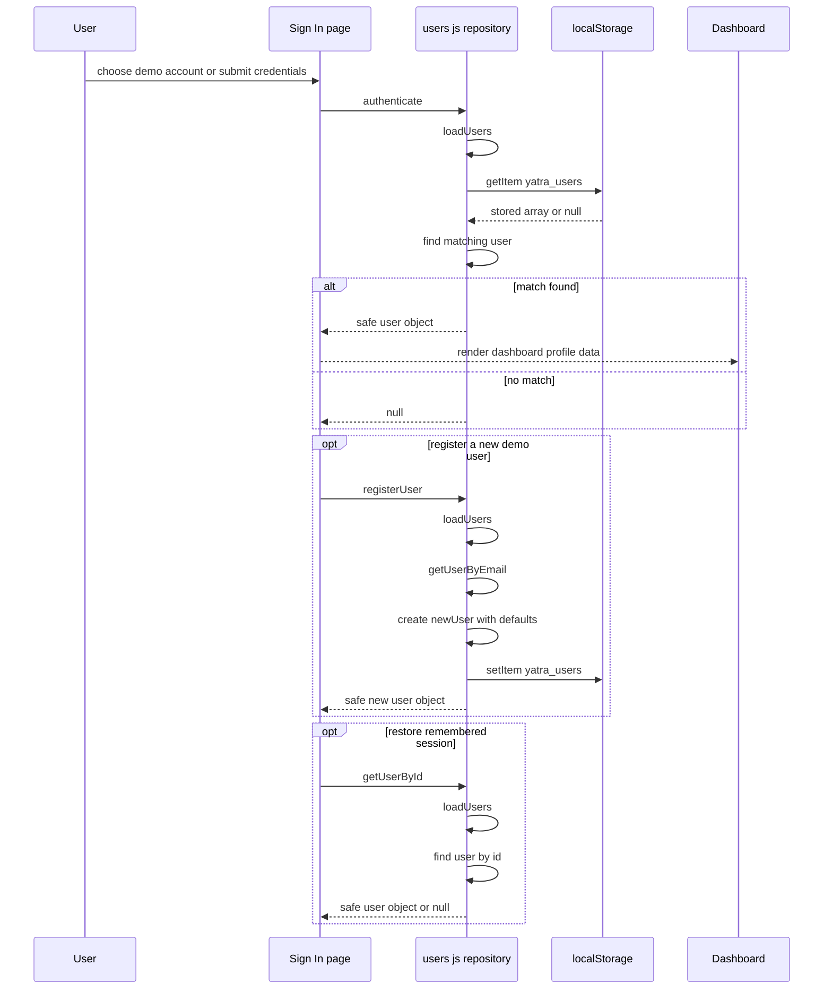

## Key Files Reference

| File | Responsibility |
| --- | --- |
| `frontend/lib/users.js` | Seed demo users, local repository state, sign-in lookup, registration, session restore lookup, and `localStorage` persistence under `yatra_users` |
| `docs/test-accounts.md` | Demo-account workflow, seeded credentials, dashboard exploration guidance, and the remembered-session key `yatra_session_uid` |


---

## Dashboard Experience and Internal Navigation/Dashboard home tab widgets and user progress presentation

# Dashboard Home Widgets and Progress Summary

## Overview

This section covers the user-facing dashboard summary layer in `frontend/components/dashboard/DashboardTab.jsx` and the widgets it composes: `frontend/components/dashboard/TentacleGrab.jsx`, `frontend/components/dashboard/SkillRadar.jsx`, and `frontend/components/dashboard/SmallWins.jsx`. It is the first dashboard surface the user sees after authentication, and it turns the local session state into progress copy, achievement stats, a skill chart, and a recent wins panel.

The tab reads the active user from `frontend/lib/AuthContext.jsx`, derives a first name from `user?.name`, and falls back to seeded values when fields are missing. It then presents `progress`, `streak`, `skills`, `pearls`, and `radarScores` as a personalized status summary built from the local user records in `frontend/lib/users.js`.

## Summary Layer Composition

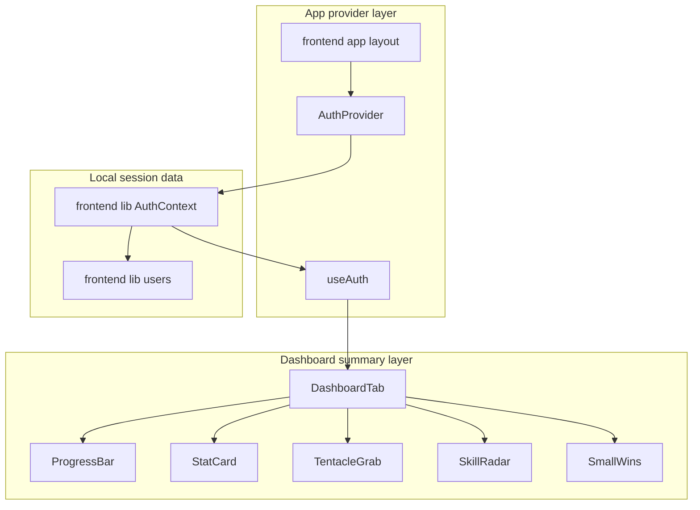

## Dashboard Tab

*`frontend/components/dashboard/DashboardTab.jsx`*

`DashboardTab` is the summary surface that assembles the welcome copy, progress bar, stat cards, hero import card, skill radar, and recent wins panel. It uses `useAuth()` to read the current `user` and then derives the user-facing values that drive the home tab presentation.

### Data binding and fallbacks

| Dashboard value | Source expression | Visible use |
| --- | --- | --- |
| `firstName` | `user?.name?.split(" ")[0] ?? "Explorer"` | Personalized greeting |
| `progress` | `user?.progress ?? 45` | Header copy and `ProgressBar` |
| `streak` | `user?.streak ?? 0` | Streak stat card |
| `skills` | `user?.skills ?? 0` | Skills stat card |
| `pearls` | `user?.pearls ?? 0` | Pearls stat card |
| `radarScores` | `user?.radarScores` | `SkillRadar` input |


### Rendered sections

- Welcome header with `firstName` highlighted in orange.
- Progress sentence that reads `progress` as a percentage and ends with the call to action `Keep sailing.`
- `ProgressBar` with accessible progress semantics.
- Three `StatCard` blocks for streak, skills, and pearls.
- `TentacleGrab` hero card.
- Two-column lower grid containing `SkillRadar` and `SmallWins`.

### Shared visual styling

`DashboardTab` uses a `glass` style object with blurred translucent panels, white borders, and inset highlights. That style is reused across the header wrapper, stat row, and lower cards to keep the summary layer visually consistent.

### Helper components inside `DashboardTab`

| Helper | Purpose |
| --- | --- |
| `Fade` | Wraps content in a `motion.div` with fade and vertical lift animation |
| `ProgressBar` | Renders the animated progress fill with `role="progressbar"` |
| `StatCard` | Renders a labeled metric with an icon, a value, and a color accent |


### Progress bar behavior

`ProgressBar` uses:

- `aria-valuenow={value}`
- `aria-valuemin={0}`
- `aria-valuemax={100}`

It animates the filled bar from width `0` to `${value}%` and uses a left-to-right gradient from `#2D5A27` to `#D35400`.

## Session State and Local User Records

### `frontend/lib/AuthContext.jsx`

`AuthContext` is the dashboard’s session source. It exposes `user`, `login`, `logout`, and `loading`, and `DashboardTab` consumes it through `useAuth()`.

| Identifier | Role |
| --- | --- |
| `SESSION_KEY` | Local storage key `yatra_session_uid` |
| `AuthProvider` | Restores the session, stores the current `user`, and exposes `login`, `logout`, and `loading` |
| `useAuth` | Reads the context value and throws if it is used outside `AuthProvider` |


Session restore flow:

- On mount, `AuthProvider` reads `savedId` from `localStorage`.
- If a saved id exists, it calls `getUserById(savedId)` from `frontend/lib/users.js`.
- If `getUserById` returns a record, `setUser(restored)` updates the dashboard state.
- The effect always clears `loading` in `finally`.

`frontend/app/layout.jsx` wraps the application in `AuthProvider`, so the dashboard widgets can access this session state.

### `frontend/lib/users.js`

`users.js` is the local record store that supplies the dashboard’s user metrics. The dashboard-relevant fields are present in `DEFAULT_USERS` and survive through `getUserById()`.

| Field | Dashboard role | Example in `DEFAULT_USERS` |
| --- | --- | --- |
| `name` | Used to derive `firstName` | `Arjun Sharma` |
| `progress` | Progress bar and completion copy | `45`, `68`, `82` |
| `streak` | Streak stat card | `12`, `21`, `34` |
| `skills` | Skills stat card | `5`, `8`, `11` |
| `pearls` | Pearls stat card | `8`, `14`, `23` |
| `radarScores` | Input to `SkillRadar` | Objects keyed by skill label |


The seeded accounts include three named profiles:

| `id` | `name` | `progress` | `streak` | `skills` | `pearls` |
| --- | --- | --- | --- | --- | --- |
| `usr_001` | `Arjun Sharma` | `45` | `12` | `5` | `8` |
| `usr_002` | `Priya Nair` | `68` | `21` | `8` | `14` |
| `usr_003` | `Rohan Mehta` | `82` | `34` | `11` | `23` |


`getUserById(id)` returns the user object without `password`, which is the shape `AuthContext` restores into dashboard state.

## Tentacle Grab Hero Card

*`frontend/components/dashboard/TentacleGrab.jsx`*

`TentacleGrab` is the dashboard’s import-and-update hero card. It lets the user paste a profile URL and reflects local success state with a temporary button change.

### Internal state

| State or handler | Role |
| --- | --- |
| `url` | Controlled input value for the URL field |
| `grabbed` | Temporary success state after a valid click |
| `handleGrab` | Starts the local success state and schedules the reset |


### Interaction behavior

- `handleGrab` exits immediately when `url.trim()` is empty.
- When the input contains text, `setGrabbed(true)` flips the button into the success state.
- `setTimeout(() => setGrabbed(false), 2000)` resets the success state after two seconds.
- The main button label switches between `Grab It` and `Grabbed ✓`.
- The button color switches from `#D35400` to `#2D5A27` while `grabbed` is true.

### Visible controls

- URL input with `type="url"` and `aria-label="LinkedIn or GitHub URL"`.
- Primary action button labeled `Grab It`.
- Quick action buttons labeled:- `Upload PDF`
- `GitHub Sync`
- `LinkedIn`
- Mentor whisper bubble that displays the `Kavi says:` message.

### Card content

The card uses the text `Import · Analyse · Evolve`, a Kavi octopus image asset, and a short explanation that tells the user to drop a LinkedIn or GitHub URL to update the path.

## Skill Radar

*`frontend/components/dashboard/SkillRadar.jsx`*

`SkillRadar` visualizes the user’s skill distribution as a radar chart. When `scores` is present, the component converts the object into label-value pairs; otherwise it falls back to `DEFAULT_SKILLS`.

### Geometry and data inputs

| Identifier | Role |
| --- | --- |
| `DEFAULT_SKILLS` | Fallback skills list |
| `SIZE` | SVG size, `220` |
| `CENTER` | Chart midpoint |
| `RINGS` | Concentric ring ratios |
| `LEVELS` | Declared as `4` |
| `polarToXY` | Converts polar positions into `x` and `y` coordinates |
| `buildPolygon` | Joins skill points into the polygon point string |


### Default skills

| Label | Default value |
| --- | --- |
| `Frontend` | `0.72` |
| `Backend` | `0.48` |
| `Logic` | `0.63` |
| `Design` | `0.55` |
| `Soft Skills` | `0.80` |


### Render behavior

- Draws concentric rings with low-opacity strokes.
- Draws axis lines from the center to each skill axis.
- Renders a filled polygon with `stroke="#2D5A27"` and a soft green fill.
- Animates skill dots at each axis point.
- Renders a legend beneath the chart with rounded percentage labels such as `72%`.

## Small Wins

> **Note:** `LEVELS` is declared as `4`, but the visible chart render uses `RINGS`, `SIZE`, `CENTER`, and the skill list derived from `scores` or `DEFAULT_SKILLS`. The displayed chart output does not reference `LEVELS`.

*`frontend/components/dashboard/SmallWins.jsx`*

`SmallWins` shows a short list of recent progress moments under the `Recent Pearls` label. The entries come from the static `WINS` array rather than from session state.

### Wins list

| Emoji | Title | Description | Date | Color |
| --- | --- | --- | --- | --- |
| `🐚` | `First GitHub Commit` | `Pushed your first open-source contribution.` | `2 days ago` | `#2D5A27` |
| `🪸` | `CSS Mastery Pearl` | `Completed the advanced Flexbox & Grid module.` | `5 days ago` | `#D35400` |
| `🌊` | `Logic Wave` | `Solved 10 algorithm challenges in a row.` | `1 week ago` | `#1B3B18` |


### Presentation behavior

- Each win appears inside a rounded translucent card.
- Each item animates in from the left with a staggered delay.
- The emoji badge uses the win’s `color` for its background, border, and glow.
- The title, description, and date are truncated cleanly when space is tight.

## User Flow

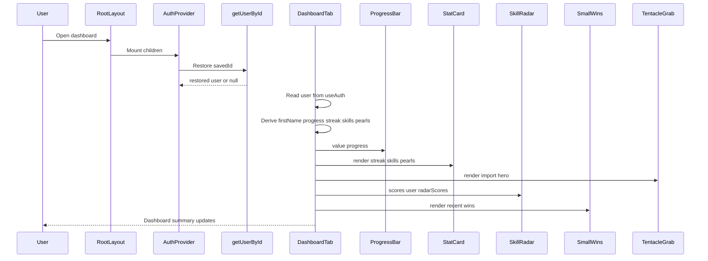

## Dependencies and Integration Points

| File or package | Role in this section |
| --- | --- |
| `frontend/app/layout.jsx` | Wraps the app in `AuthProvider` |
| `frontend/lib/AuthContext.jsx` | Supplies the current user and session restore behavior |
| `frontend/lib/users.js` | Stores the local user records and seeded dashboard metrics |
| `framer-motion` | Drives the entrance, fill, and card animations |
| `lucide-react` | Supplies the icons used in the stat row and cards |
| `next/image` | Renders the hero and octopus artwork |


The summary layer also reuses the same color system across widgets: `#1B3B18`, `#2D5A27`, and `#D35400`.

## Fallback and Error Handling

The dashboard summary layer uses local fallbacks rather than empty states for the core progress values.

- `firstName` falls back to `Explorer` when `user?.name` is not available.
- `progress` falls back to `45`.
- `streak`, `skills`, and `pearls` fall back to `0`.
- `SkillRadar` falls back to `DEFAULT_SKILLS` when `scores` is missing.
- `TentacleGrab` ignores empty input and only enters the grabbed state when the input has non-whitespace content.
- `AuthProvider` guards `localStorage` access with `try` and `catch` blocks during session restore and login or logout persistence.

## Dashboard Summary at a Glance

| Widget | Source | User-facing role |
| --- | --- | --- |
| Welcome header | `user?.name`, `progress` | Personalized greeting and completion copy |
| Progress bar | `progress` | Animated completion indicator |
| Stat cards | `streak`, `skills`, `pearls` | Quick progress metrics |
| `TentacleGrab` | Local input state | Profile import and update entry point |
| `SkillRadar` | `radarScores` or `DEFAULT_SKILLS` | Skill distribution visualization |
| `SmallWins` | Static `WINS` list | Recent achievements and momentum |


---

## Authentication, Session State, and Demo User Model/Login and sign-up page behavior for the demo flow

# Authentication, Session State, and Demo User Model

## Overview

This section covers the login page used for the demo flow in `frontend/app/login/page.jsx`, the session handoff it triggers through `frontend/lib/AuthContext.jsx`, and the demo account notes documented in `docs/test-accounts.md`. The page is a client-side authentication UI with two tabs: one for signing in with the existing demo accounts, and one for a demo sign-up experience.

## Source-Backed Files

| File | Role in this section |
| --- | --- |
| `frontend/app/login/page.jsx` | Main authentication screen, tabbed sign-in and sign-up UI, submit handlers, and test-account shortcuts. |
| `frontend/lib/AuthContext.jsx` | Receives successful sign-in through `login(userObj, remember)` and manages the session key used for remembered sessions. |
| `docs/test-accounts.md` | Documents the demo users, explains the test-account shortcut behavior, and states that sign-up is demo behavior rather than persisted registration. |


## Login Page Behavior

### Shared Page Structure

*File: `frontend/app/login/page.jsx`*

`LoginPage` keeps its own local UI state with `useState` and renders two animated forms inside `AnimatePresence`. The active tab is controlled by `tab`, which switches between `"signin"` and `"signup"`. Both forms reuse `inputCls` for consistent input styling, and both password fields can be shown or hidden with the same Eye and EyeOff icon pattern.

The page also renders a test-account panel labeled “Test Accounts — click to fill”. That panel is driven by `TEST_USERS` and gives the user a shortcut into the sign-in flow.

### Sign In Tab

*File: `frontend/app/login/page.jsx`*

| Control or state | Behavior in the page |
| --- | --- |
| `siEmail` | Holds the sign-in email field value. |
| `siPass` | Holds the sign-in password field value. |
| `showSi` | Switches the sign-in password input between text and password modes. |
| `remember` | Captures the remember-me choice and is passed to `login(user, remember)`. |
| `siError` | Renders the sign-in error banner. |
| `siLoading` | Disables the submit button and swaps the label to a loading state. |


The sign-in handler, `handleSignIn`, does the following in order:

1. Prevents the form submit default.
2. Clears the previous sign-in error.
3. Sets `siLoading` to `true`.
4. Waits 600 ms to simulate a network call.
5. Calls `authenticate(siEmail, siPass)`.
6. If no user is returned, shows the message `Wrong email or password. Check the test accounts below.` and stops.
7. If a user is returned, calls `login(user, remember)` from `useAuth`.
8. Sends the user to `/dashboard` with `router.push("/dashboard")`.

The submit button uses the loading state to disable interaction and show a spinner. The rest of the sign-in form keeps standard `required` validation on both fields.

### Sign Up Tab

*File: `frontend/app/login/page.jsx`*

| Control or state | Behavior in the page |
| --- | --- |
| `suName` | Holds the demo sign-up name field value. |
| `suEmail` | Holds the demo sign-up email field value. |
| `suPass` | Holds the demo sign-up password field value. |
| `showSu` | Switches the sign-up password input between text and password modes. |
| `suError` | Renders the sign-up error banner. |
| `suSuccess` | Replaces the form with the success card after a successful demo registration. |


The sign-up handler, `handleSignUp`, is intentionally non-persistent and demo-oriented:

1. Prevents the form submit default.
2. Clears the previous sign-up error and any previous success state.
3. Waits 600 ms to simulate a network call.
4. Calls `registerUser({ name: suName, email: suEmail, password: suPass })`.
5. If no user is returned, shows the message `This email is already registered. Try signing in or use a different email.`
6. If a new user is returned, shows the success state with `CheckCircle2`.
7. After 1600 ms, switches the tab back to `"signin"`, copies `newUser.email` into `siEmail`, clears `siPass`, and clears the success state.

The sign-up form requires `Full Name`, `Email`, and `Password`, and the password field has `minLength={8}`.

### Test Account Surface

*File: `frontend/app/login/page.jsx` and `docs/test-accounts.md`*

The page surfaces `TEST_USERS` as a clickable list. Each row shows the demo user’s name, email, and a subscription label, and clicking a row does three things at once:

- switches the page to the Sign In tab,
- fills `siEmail` with `u.email`,
- fills `siPass` with `u.password`,
- clears any prior sign-in error.

`docs/test-accounts.md` explains the same shortcut in text: use the credentials on the Sign In page and click any account row to auto-fill the fields. The document also points back to `frontend/lib/users.js` as the source of the stored demo credentials.

## Session State Hand-Off

*File: `frontend/app/login/page.jsx`, `frontend/lib/AuthContext.jsx`*

Successful sign-in hands the selected demo user to `useAuth().login`. The page passes the current `remember` checkbox value into `login(user, remember)`, so the checkbox directly controls whether the session should be remembered.

In `frontend/lib/AuthContext.jsx`, `login` accepts the user object and the remember flag. When the flag is true, it stores `userObj.id` in `localStorage` under `SESSION_KEY`, which is `yatra_session_uid`. That makes the sign-in page the entry point for the remembered-session path, even though the persistence logic lives in the auth context.

## User Flow

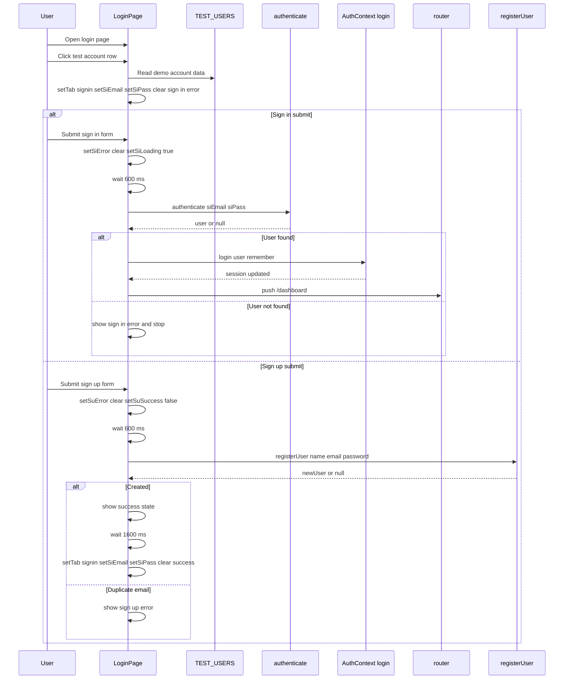

## Validation and Error Handling

*File: `frontend/app/login/page.jsx`*

- Sign-in email and password are both marked `required`.
- Sign-up full name, email, and password are all marked `required`.
- Sign-up password is also constrained with `minLength={8}`.
- Sign-in failure is handled by checking whether `authenticate(siEmail, siPass)` returns a user.
- Sign-up failure is handled by checking whether `registerUser({ name: suName, email: suEmail, password: suPass })` returns a user.
- The page clears field-specific error state as the user types into sign-in inputs, and the test-account shortcut also clears the current sign-in error.

The page also includes a `Forgot password?` link rendered as `a href="#"`, and a second set of social buttons for GitHub, Google, and LinkedIn. Those are visible UI elements in this file.

## Dependencies

| Dependency | Role in this section |
| --- | --- |
| `useState` | Stores tab state, input values, password visibility, errors, loading, and success state. |
| `Link` | Renders navigation to the home page. |
| `motion`, `AnimatePresence` | Animate the tab switch, error cards, loading indicator, and success card. |
| `Eye`, `EyeOff` | Toggle password visibility in both forms. |
| `AlertCircle`, `CheckCircle2` | Show sign-in error and sign-up success feedback. |
| `useAuth` | Provides `login` for the sign-in handoff. |
| `authenticate` | Validates the sign-in credentials against the demo user set. |
| `registerUser` | Handles the demo sign-up path. |
| `TEST_USERS` | Supplies the clickable demo-account rows on the login page. |


## Demo Account Reference

*File: `docs/test-accounts.md`*

| Name | Email | Password | Plan | Goal | DOB | Progress | Streak |
| --- | --- | --- | --- | --- | --- | --- | --- |
| Arjun Sharma | arjun.sharma@gmail.com | Yatra2025! | Explorer free | Land a Frontend Engineer role at a product company | March 12, 2003 | 45% | 12 days |
| Priya Nair | priya.nair@gmail.com | Ocean#2025 | Navigator ₹999 per month | Become a UX Product Designer at a SaaS startup | July 4, 2002 | 68% | 21 days |
| Rohan Mehta | rohan.mehta@gmail.com | Captain99$ | Captain ₹7999 per year | Get into a top ML research lab or FAANG as a Data Scientist | November 28, 2001 | 82% | 34 days |


These are the credentials the page points users toward when sign-in fails. The document also states that the passwords live in `frontend/lib/users.js` and should not be treated as production credentials.

## Key Files Reference

| File | Responsibility |
| --- | --- |
| `frontend/app/login/page.jsx` | Implements the full demo login and sign-up experience, including form switching, simulated delays, test-account shortcuts, and redirect to `/dashboard`. |
| `frontend/lib/AuthContext.jsx` | Stores the signed-in user through `login(userObj, remember)` and writes the remembered session key `yatra_session_uid` when requested. |
| `docs/test-accounts.md` | Documents the demo users and explains that sign-up is a demo flow rather than a persisted registration system. |


---

## Dashboard Experience and Internal Navigation/Roadmap and mentor dashboard tabs

# Dashboard Experience and Internal Navigation - Roadmap and Mentor Tabs

*`frontend/app/dashboard/page.jsx`, `frontend/components/dashboard/RoadmapTab.jsx`, `frontend/components/dashboard/MentorTab.jsx`, `frontend/app/api/groq/chat/route.js`, `frontend/app/api/deepseek/chat/route.js`, `frontend/app/api/groq/roadmap/route.js`, `frontend/app/api/deepseek/roadmap/route.js`*

## Overview

This dashboard slice is the tabbed work area inside `frontend/app/dashboard/page.jsx`. The page resolves an `activeTab` value through `TABS` and swaps between `DashboardTab`, `RoadmapTab`, `MentorTab`, and `AccountTab`, while `BottomNavBar` provides the main tab switcher. The page header also adds a small set of non-tab navigation actions through `NAV_LINKS` and a logout action that routes the user back to `/login`.

`frontend/components/dashboard/RoadmapTab.jsx` and `frontend/components/dashboard/MentorTab.jsx` are the two tab surfaces that matter for this section. `RoadmapTab` is a visible roadmap work area with a map-like presentation and a `Start Analysis` call-to-action. `MentorTab` is the AI mentor surface: it contains a chat mode backed by `/api/groq/chat` and a second internal mode that mounts `ResumeAnalyzer`.

The route files `frontend/app/api/groq/chat/route.js`, `frontend/app/api/deepseek/chat/route.js`, `frontend/app/api/groq/roadmap/route.js`, and `frontend/app/api/deepseek/roadmap/route.js` define the server-side AI behavior that sits behind the broader chat and roadmap-generation family used in Yatra. In this source slice, the dashboard mentor tab explicitly calls the Groq chat route, while the roadmap tab itself remains a presentation surface rather than the roadmap generator trigger.

## Internal Navigation Wiring

| File | Role in this section | Observed wiring |
| --- | --- | --- |
| `frontend/app/dashboard/page.jsx` | Dashboard tab host | Defines `TABS`, creates `activeTab` state, renders the selected component as `ActiveComponent`, and mounts `BottomNavBar` with `activeTab` and `setActiveTab` |
| `frontend/components/dashboard/BottomNavBar.jsx` | Bottom tab switcher | Exposes `NAV_ITEMS` for `dashboard`, `roadmap`, `mentor`, and `account`; clicking a tab calls `setActiveTab(tab)` |
| `frontend/components/dashboard/RoadmapTab.jsx` | Roadmap work area | Renders the roadmap-themed panel, illustration, and `Start Analysis` button |
| `frontend/components/dashboard/MentorTab.jsx` | Mentor work area | Renders the chat and resume toggle, and the chat view posts to `/api/groq/chat` |
| `frontend/app/api/groq/chat/route.js` | Groq chat handler | Accepts `userMessage` and `chatHistory`, builds `messages`, and returns `{ text }` |
| `frontend/app/api/deepseek/chat/route.js` | OpenRouter chat handler | Accepts the same chat payload shape and returns `{ text }` |
| `frontend/app/api/groq/roadmap/route.js` | Groq roadmap handler | Accepts `goal`, generates roadmap JSON, and returns `{ roadmap }` |
| `frontend/app/api/deepseek/roadmap/route.js` | OpenRouter roadmap handler | Accepts `goal`, parses the model output as JSON, and returns `{ roadmap }` |
| `frontend/components/YatraPricing.jsx` | Related AI surface | Uses `chatWithGuide` and `generateAIRoadmap` against `/api/groq/chat` and `/api/groq/roadmap`, which makes it the pricing-page counterpart to the dashboard mentor and roadmap family |


## Dashboard Page Shell

*`frontend/app/dashboard/page.jsx`*

`frontend/app/dashboard/page.jsx` is the client-side shell that owns tab selection and auth gating. It imports `useAuth`, `useRouter`, `motion`, `AnimatePresence`, `Menu`, `X`, and the four tab components, then uses `TABS` to map the active key to the visible content.

### Tab map

| Tab key | Component |
| --- | --- |
| `dashboard` | `DashboardTab` |
| `roadmap` | `RoadmapTab` |
| `mentor` | `MentorTab` |
| `account` | `AccountTab` |


### Navigation behavior

- `NAV_LINKS` contains:- `Features` → `/features`
- `Pricing` → `/pricing`
- `DashboardHeader` reads `user` and `logout` from `useAuth`.
- `handleLogout` calls `logout()` and then `router.push("/login")`.
- A `useEffect` redirect sends unauthenticated users to `/login` with `router.replace("/login")`.
- While `loading` is true, the page shows a centered spinning indicator.
- When `user` is missing after loading completes, the page renders nothing.

## Roadmap Tab

*`frontend/components/dashboard/RoadmapTab.jsx`*

`RoadmapTab` is the roadmap work area that appears as one of the `TABS` values in `frontend/app/dashboard/page.jsx`. It uses `motion`, `Image`, `Map`, and `Anchor` to build a centered card that reads like an in-progress journey rather than a data-heavy editor.

### What the tab renders

- A looping illustration using `/assets/свеча-Photoroom.png`- `My Roadmap`
- `The Map is Being Drawn`
- Supporting text that says the roadmap is being charted
- A `Start Analysis` button
- A `Coming Soon` label with decorative animated dots

### Observed interaction scope

The component is presentational in this file. The visible `Start Analysis` button is rendered without a handler in `frontend/components/dashboard/RoadmapTab.jsx`, so the tab itself is the roadmap-facing dashboard surface, not the AI generation request issuer.

## Mentor Tab

*`frontend/components/dashboard/MentorTab.jsx`*

`MentorTab` is the AI mentor work area. It imports `ResumeAnalyzer`, maintains an internal `view` state, and switches between a chat panel and a resume panel through a two-button sub-navigation.

### Main exported component

`MentorTab` renders:

- A header labeled `AI-Powered Guidance`
- The title `AI Mentor`
- A subtitle that says the user can chat with Kavi or get a deep resume analysis
- A toggle with two modes:- `chat` → `Chat with Kavi`
- `resume` → `Resume Analyser`

### Internal helpers

| Helper | Responsibility |
| --- | --- |
| `Bubble` | Renders one chat message and changes alignment, background, and corner shape based on `role` |
| `TypingDots` | Shows the animated loading indicator while the assistant is typing |
| `MentorChat` | Manages the message list, input field, loading state, scroll anchoring, and the POST request to `/api/groq/chat` |


### Mentor chat state

| State | Purpose |
| --- | --- |
| `messages` | Holds the chat transcript, starting with the assistant greeting |
| `input` | Tracks the textarea contents |
| `loading` | Controls the typing indicator and disables repeated sends |
| `bottomRef` | Keeps the chat scrolled to the latest message |


### Chat behavior

- The input uses `onKeyDown={handleKey}` so Enter sends the message and Shift+Enter creates a new line.
- `send` trims the current input, ignores empty submissions, and returns early while `loading` is true.
- The request body sent by `MentorChat` includes:- `userMessage`
- `chatHistory`
- `systemPrompt`
- The response is read from `data.text`.
- If the request fails, the UI appends fallback assistant text such as `The currents are rough — try again.` or `Lost signal. Try again in a moment.`

### Mentor view switch

MentorTab sends systemPrompt in the request body, but frontend/app/api/groq/chat/route.js and frontend/app/api/deepseek/chat/route.js only destructure userMessage and chatHistory = []. The extra field is ignored by those handlers, so the server-side SYSTEM_PROMPT constants in the route files define the actual assistant persona.

The `view` state starts at `"chat"` and toggles to `"resume"` when the user selects `Resume Analyser`. That second branch mounts `ResumeAnalyzer`, which keeps the mentor tab as a two-part internal workspace rather than a single chat-only panel.

## AI Route Touchpoints

*`frontend/app/api/groq/chat/route.js`, `frontend/app/api/deepseek/chat/route.js`, `frontend/app/api/groq/roadmap/route.js`, `frontend/app/api/deepseek/roadmap/route.js`*

These route files are the server-side AI touchpoints referenced by the dashboard mentor and roadmap surfaces, plus the related pricing-page lab in `frontend/components/YatraPricing.jsx`.

| File | Observed request shape | Observed output shape | Processing notes |
| --- | --- | --- | --- |
| `frontend/app/api/groq/chat/route.js` | `userMessage`, `chatHistory = []` | `{ text }` | Builds `messages`, maps `m.role === "model"` to `assistant`, calls `groq.chat.completions.create` with `model: "llama-3.3-70b-versatile"`, `temperature: 0.7`, and `max_completion_tokens: 512` |
| `frontend/app/api/deepseek/chat/route.js` | `userMessage`, `chatHistory = []` | `{ text }` | Sends the chat payload to OpenRouter at `https://openrouter.ai/api/v1/chat/completions` with `model: "google/gemma-4-26b-a4b-it:free"` and `temperature: 0.7` |
| `frontend/app/api/groq/roadmap/route.js` | `goal` | `{ roadmap }` | Prompts for JSON only, calls `groq.chat.completions.create` with `model: "llama-3.3-70b-versatile"`, `temperature: 0.4`, `max_completion_tokens: 1024`, and `stream: false`, then strips fences and parses JSON |
| `frontend/app/api/deepseek/roadmap/route.js` | `goal` | `{ roadmap }` | Sends the roadmap prompt to OpenRouter with `model: "google/gemma-4-26b-a4b-it:free"` and `temperature: 0.4`, then strips fences and parses JSON |


### Route-level behavior that matters here

- The chat handlers validate that `userMessage` is a string and return a 400 response when it is missing.
- The roadmap handlers validate `goal` and return a 400 response when it is missing.
- Both roadmap handlers clean model output by removing markdown code fences before JSON parsing.
- The Groq chat route and the OpenRouter chat route both use the same `SYSTEM_PROMPT` style for the mentor persona family.
- The roadmap routes both use the same JSON-only structure with `roadmapTitle` and `waves`.

## Feature Flows

### Switch between dashboard tabs

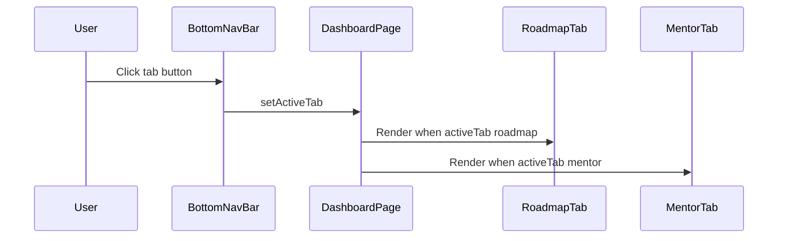

### Send a mentor chat message

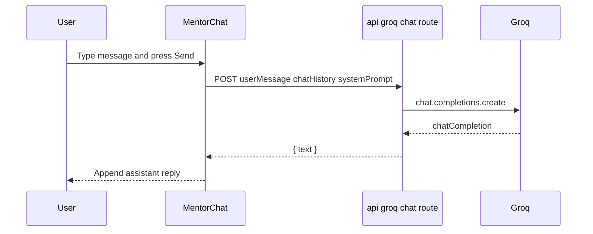

## State Management

### Dashboard page state

- `activeTab` in `frontend/app/dashboard/page.jsx` selects the visible tab component.
- `mobileOpen` in `DashboardHeader` controls the mobile navigation dropdown.
- `loading` from `useAuth` controls the initial spinner and the redirect timing.
- `user` from `useAuth` determines whether the dashboard renders and feeds the header identity badge.

### Mentor tab state

- `view` in `MentorTab` switches between the chat work area and `ResumeAnalyzer`.
- `messages`, `input`, and `loading` in `MentorChat` keep the conversation and request lifecycle local to the chat panel.
- `bottomRef` keeps the chat scrolled to the latest assistant or user message.

## Error Handling

- `frontend/app/dashboard/page.jsx` shows a loading spinner while auth state is restoring, then routes unauthenticated users to `/login`.
- `MentorChat` guards against empty sends and concurrent sends with `if (!msg || loading) return;`.
- `MentorChat` falls back to visible assistant text when the fetch fails or when the response does not contain usable text.
- `frontend/app/api/groq/chat/route.js` and `frontend/app/api/deepseek/chat/route.js` return a 400 error for missing `userMessage`.
- `frontend/app/api/groq/roadmap/route.js` and `frontend/app/api/deepseek/roadmap/route.js` return a 400 error for missing `goal`.
- Both roadmap handlers attempt to parse the model output as JSON and return a 500 error when parsing fails.

## Integration Points

- `frontend/lib/AuthContext.jsx` supplies `user`, `logout`, and `loading`, which the dashboard page uses for gating and logout routing.
- `frontend/app/layout.jsx` mounts `AuthProvider`, making the dashboard auth state available on the client.
- `frontend/components/YatraPricing.jsx` uses the same chat and roadmap route family through `chatWithGuide` and `generateAIRoadmap`, so the dashboard mentor and roadmap surfaces sit next to a pricing-page AI lab rather than being isolated features.
- The deepseek and groq route pairs share the same prompt structure but differ in provider strategy:- Groq routes use `groq-sdk`
- Deepseek routes use OpenRouter fetch calls

## Dependencies

### `frontend/app/dashboard/page.jsx`

- `useState`, `useEffect` from `react`
- `Link` from `next/link`
- `useRouter` from `next/navigation`
- `motion`, `AnimatePresence` from `framer-motion`
- `Menu`, `X` from `lucide-react`
- `useAuth` from `@/lib/AuthContext`
- `BottomNavBar`, `DashboardTab`, `RoadmapTab`, `MentorTab`, `AccountTab`

### `frontend/components/dashboard/RoadmapTab.jsx`

- `Image` from `next/image`
- `motion` from `framer-motion`
- `Map`, `Anchor` from `lucide-react`

### `frontend/components/dashboard/MentorTab.jsx`

- `useState`, `useRef`, `useEffect` from `react`
- `Image` from `next/image`
- `motion`, `AnimatePresence` from `framer-motion`
- `MessageCircle`, `Send`, `FileSearch`, `Sparkles` from `lucide-react`
- `ResumeAnalyzer` from `./ResumeAnalyzer`

### Route handlers

- `frontend/app/api/groq/chat/route.js` and `frontend/app/api/groq/roadmap/route.js` use `Groq` from `groq-sdk`
- `frontend/app/api/deepseek/chat/route.js` and `frontend/app/api/deepseek/roadmap/route.js` use `NextResponse` from `next/server` and `fetch` to OpenRouter
- `process.env.GROQ_API_KEY` is used by the Groq routes
- `process.env.OPENROUTER_API_KEY` is used by the OpenRouter routes

## Related AI Surface

*`frontend/components/YatraPricing.jsx`*

---

## Dashboard Experience and Internal Navigation/Account tab, profile details, and account-management affordances

# Account Tab and Account Management

*frontend/components/dashboard/AccountTab.jsx*

## Overview

The Account tab is the profile and settings surface for a signed-in user. It renders the current user’s identity data, subscription tier, and account-management affordances in one card-style panel, using the session object returned by `useAuth`.

The surface is intentionally local and lightweight: the tab reads from the current in-memory user record, animates open and close states with `framer-motion`, and uses `useRouter` only to send the user back to the login route after logout. The only durable state change in this file is logout; the password-reset panel is a UI interaction that does not write back to the user store.

## Surface Composition

### Header and session controls

The top of `AccountTab` presents a branded account header with three visible pieces of information:

- `Personal Oasis`
- `My Account`
- `Member since {user?.memberSince ?? "—"}`

A `Log out` button sits on the right side of the header and calls the logout flow described below. The button is rendered with a `LogOut` icon and hover/tap animation.

### Subscription badge

The subscription badge uses `SUBSCRIPTION_COLORS` to color the current plan label. The plan lookup is based on `user?.subscription`, with a fallback to `Explorer` when the field is missing or unrecognized.

| Plan | Background | Border | Text |
| --- | --- | --- | --- |
| `Explorer` | `rgba(27,59,24,0.10)` | `rgba(27,59,24,0.20)` | `#1B3B18` |
| `Navigator` | `rgba(211,84,0,0.10)` | `rgba(211,84,0,0.22)` | `#D35400` |
| `Captain` | `rgba(45,90,39,0.12)` | `rgba(45,90,39,0.25)` | `#2D5A27` |


The badge includes a `Crown` icon, the label `Subscription Plan`, the current plan name, and an `Upgrade` button. The `Upgrade` button has visual styling only; no click handler is attached in this file.

### Profile details

The profile section is rendered inside a frosted panel using the shared `glass` style object. It shows four `InfoRow` entries, each bound directly to a field from the current user object.

| Display label | User record field | Fallback in UI | Notes |
| --- | --- | --- | --- |
| `Full Name` | `user?.name` | `—` | Rendered with the `User` icon |
| `Email` | `user?.email` | `—` | Rendered with the `Mail` icon |
| `Date of Birth` | `user?.birthDate` | `—` | Rendered with the `Calendar` icon |
| `Current Goal` | `user?.goal` | `—` | Rendered with the `Target` icon |


`InfoRow` receives `icon`, `label`, `value`, and `accent`. It draws the icon in a tinted circle and prints the label in compact uppercase text above the value.

### Password reset accordion

`PasswordReset` is an expandable security panel. The header row shows `Security` and `Reset Password`, plus a `ChevronRight` indicator that rotates when the panel opens. When expanded, it displays three password inputs:

- `Current password`
- `New password`
- `Confirm new`

Each input has a visibility toggle button using `Eye` and `EyeOff`. The section shows a validation warning when the new and confirmation values differ. The submit button is disabled until all validation rules pass.

Validation in the component is local and explicit:

- current password length must be at least 6
- new password length must be at least 8
- new password must match confirmation

When the form submits successfully, the component shows `Password updated!` with a `CheckCircle2` icon, clears the fields, and closes itself after 2200 ms.

### Account-management affordances

| Surface | Trigger | Behavior | State change |
| --- | --- | --- | --- |
| `Log out` | Header button | Calls `logout()` from `useAuth`, then `router.push("/login")` | Yes |
| `Upgrade` | Subscription badge button | Visual affordance only | No |
| `Delete account` | Danger-zone button | Rendered without a click handler | No |
| Password visibility toggles | Eye buttons | Switch each field between text and password | Yes, local UI state only |
| Password reset accordion | Header button | Opens and closes the form | Yes, local UI state only |
| `Update Password` | Form submit | Shows success, clears fields, auto-closes | Yes, local UI state only |


## Runtime Wiring

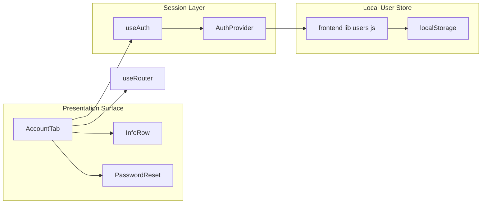

PasswordReset presents a successful password update, but the handler only updates local component state. It does not write to frontend/lib/users.js or invoke a backend route, so the stored password in the user record is unchanged.

`AccountTab` consumes the current `user` and `logout` function from `useAuth`. The user object is expected to include the fields shown in the profile and subscription sections, and the logout path clears the session before redirecting away from the dashboard.

## Internal Components and State

### `InfoRow`

`InfoRow` is the reusable display unit for profile details.

| Prop | Purpose |
| --- | --- |
| `icon` | The icon component rendered in the leading badge |
| `label` | Uppercase descriptor shown above the value |
| `value` | The user-facing field value |
| `accent` | Color used for the icon badge and icon tint |


### `PasswordReset`

`PasswordReset` is the only stateful subcomponent in the file besides the top-level account surface.

| State variable | Initial value | Purpose |
| --- | --- | --- |
| `open` | `false` | Controls accordion visibility |
| `current` | `""` | Current password input value |
| `next` | `""` | New password input value |
| `confirm` | `""` | Confirmation input value |
| `showCur` | `false` | Toggles visibility for current password |
| `showNew` | `false` | Toggles visibility for new password |
| `showCon` | `false` | Toggles visibility for confirmation |
| `success` | `false` | Controls the success message state |


The component maps its three inputs from a small inline configuration array, which keeps the field labels and toggle behavior consistent. The `Update Password` button uses `canSubmit` to control both disabled state and hover/tap motion.

### `AccountTab`

`AccountTab` itself binds the current user and session helpers from `useAuth`, then derives the active subscription palette from `SUBSCRIPTION_COLORS`.

| Binding | Purpose |
| --- | --- |
| `user` | Current authenticated record used for display |
| `logout` | Clears the session through `AuthContext` |
| `router` | Navigates to the login screen after logout |
| `sub` | Selected subscription palette for the badge |
| `handleLogout` | Calls `logout()` and pushes `/login` |


The visible record fields in the UI resolve directly from `user?.name`, `user?.email`, `user?.birthDate`, `user?.goal`, `user?.subscription`, and `user?.memberSince`, each with a `—` fallback except subscription, which defaults to `Explorer`.

## User Record Contract

*frontend/lib/users.js*

### Local store behavior

`frontend/lib/users.js` is the source of the user record shape used by the account tab and session restore flow.

- `STORAGE_KEY` is `yatra_users`
- `DEFAULT_USERS` seeds three starter records
- `users` begins as a shallow copy of `DEFAULT_USERS`
- `loadUsers()` replaces `users` with the parsed localStorage array when one exists
- `saveUsers()` writes the current array back to localStorage
- `TEST_USERS` exports the starter array directly

`authenticate(email, password)` and `getUserById(id)` both return safe user objects without `password`. `registerUser({ name, email, password })` creates a new local record with default account fields, `subscription: "Explorer"`, and a generated `memberSince` value.

### Record fields in `DEFAULT_USERS`

| Field | Example value in source | Used by `AccountTab` |
| --- | --- | --- |
| `id` | `usr_001` | Indirectly through session restore in `AuthContext` |
| `name` | `Arjun Sharma` | Yes |
| `email` | `arjun.sharma@gmail.com` | Yes |
| `password` | `Yatra2025!` | No |
| `birthDate` | `March 12, 2003` | Yes |
| `goal` | `Land a Frontend Engineer role at a product company` | Yes |
| `bio` | `Full-Stack Explorer · CS Junior` | No |
| `subscription` | `Explorer` | Yes |
| `memberSince` | `January 2025` | Yes |
| `avatar` | `/assets/3d_prof_anf.png` | No |
| `progress` | `45` | No |
| `streak` | `12` | No |
| `skills` | `5` | No |
| `pearls` | `8` | No |
| `radarScores` | `{ Frontend: 0.72, Backend: 0.38, Logic: 0.55, Design: 0.60, SoftSkills: 0.70 }` | No |


The same shape repeats across the other starter records, with `subscription` values of `Navigator` and `Captain`. Those values are the ones that drive the subscription badge palette in `AccountTab`.

## Logout and Password Reset Flows

### Logout flow

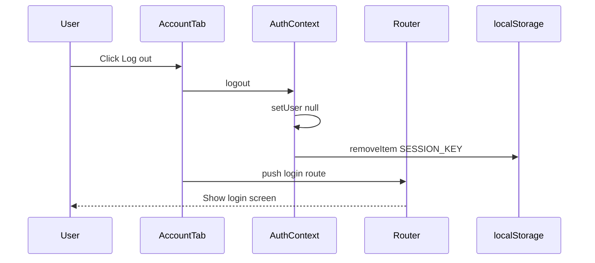

The logout action is the only account-management control in this file that changes persistent session state. It clears the session key and immediately moves the user away from the dashboard.

### Password reset flow

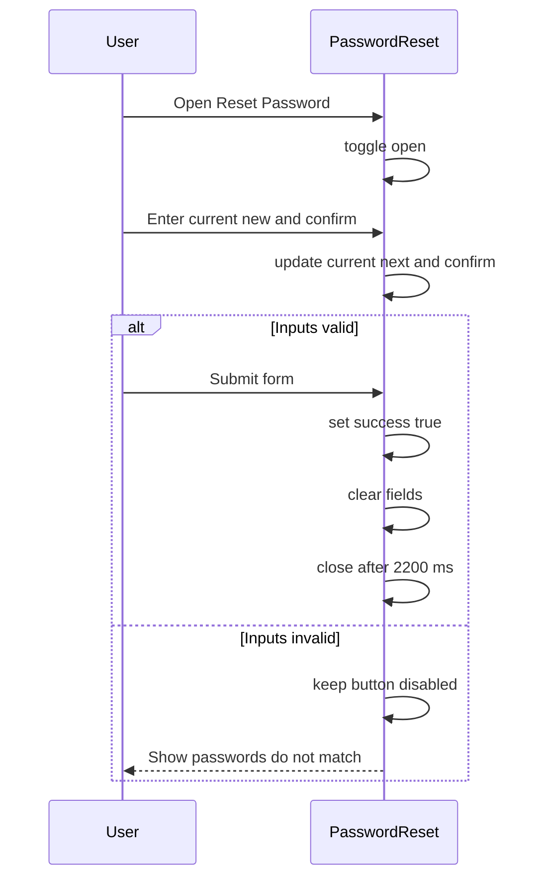

This flow is entirely client-side. It provides immediate validation, visibility toggles, and success feedback, but it does not persist a new password into the local user store.

## Key Files Reference

| File | Responsibility |
| --- | --- |
| `frontend/components/dashboard/AccountTab.jsx` | Renders the account header, subscription badge, profile rows, password reset accordion, logout control, and inactive account actions |
| `frontend/lib/users.js` | Defines the local user record shape, starter accounts, and localStorage-backed helpers |
| `frontend/lib/AuthContext.jsx` | Supplies `user` and `logout`, and restores the session by `getUserById(savedId)` from the stored session id |


---

## Dashboard Experience and Internal Navigation/Dashboard navigation components across mobile and desktop

# Dashboard Experience and Internal Navigation

## Overview

This dashboard navigation layer is built around two distinct interaction patterns: a persistent in-dashboard tab switcher and a sticky dashboard header for site-level links and session actions. On desktop and mobile, the user can move between dashboard content areas without a full page load, while also reaching marketing pages or logging out from the top chrome.

The dashboard page uses local tab state to swap between `DashboardTab`, `RoadmapTab`, `MentorTab`, and `AccountTab`. The tab bar at the bottom is the primary in-dashboard control in `frontend/app/dashboard/page.jsx`, while `DashboardSidebar.jsx` provides a separate repository-side navigation shell with overlapping labels and a different layout strategy. The header inside `frontend/app/dashboard/page.jsx` adds the brand link, marketing links, user identity pill, mobile dropdown, and logout actions.

## Navigation Surfaces at a Glance

| File | Surface | Labels | Icons | Interaction model | Active state | Logout |
| --- | --- | --- | --- | --- | --- | --- |
| `frontend/app/dashboard/page.jsx` | Inline `DashboardHeader` | `Features`, `Pricing` | `Menu`, `X` for the mobile toggle | `Link` navigation for desktop and mobile header items; burger opens a dropdown menu | No tab active state in the header | Yes, desktop button and mobile button both call `handleLogout` |
| `frontend/components/dashboard/BottomNavBar.jsx` | Persistent bottom pill nav | `Dashboard`, `Roadmap`, `Mentor`, `Account` | `LayoutDashboard`, `Map`, `MessageCircle`, `UserCircle` | `button` controls that call `setActiveTab` | Dark filled pill, light label text, animated label width, `aria-current="page"` on the active tab | No |
| `frontend/components/dashboard/DashboardSidebar.jsx` | Desktop sidebar plus mobile bottom nav | Desktop: `Dashboard`, `My Roadmap`, `AI Mentor`; mobile: same three labels | `LayoutDashboard`, `Map`, `MessageCircle`, `User` in the profile card | `button` controls that call `setActiveTab` | Desktop glass highlight, mobile orange text highlight | No |


## `frontend/app/dashboard/page.jsx`

> **Note:** `frontend/app/dashboard/page.jsx` explicitly renders `BottomNavBar` and the inline `DashboardHeader`. `frontend/components/dashboard/DashboardSidebar.jsx` is a separate source file that implements a similar dashboard navigation vocabulary with its own desktop and mobile layouts.

The page file is where the dashboard shell is actually assembled. It defines the tab map in `TABS`, keeps the current dashboard section in local `activeTab` state, and renders the selected component through `ActiveComponent = TABS[activeTab]`. The navigation UI then drives that state through `BottomNavBar`.

### Dashboard tab wiring

- `TABS` maps:- `dashboard` to `DashboardTab`
- `roadmap` to `RoadmapTab`
- `mentor` to `MentorTab`
- `account` to `AccountTab`
- `DashboardPage` keeps `activeTab` in local state and passes `activeTab` plus `setActiveTab` to `BottomNavBar`.
- The selected tab content is wrapped in `AnimatePresence` and `motion.div`, so the view changes animate when the user taps a different tab.

### `DashboardHeader`

`DashboardHeader` is the dashboard-specific top bar rendered inline inside the page. It combines global navigation, session display, and a mobile menu.

#### Desktop behavior

- The brand link `Yatra` points to `/`.
- `NAV_LINKS` contains:- `Features` linking to `/features`
- `Pricing` linking to `/pricing`
- The right-side desktop cluster shows:- a status pill with `user?.name ?? "Explorer"`
- a `Log out` button that runs `handleLogout`

#### Mobile menu behavior

- A burger button toggles `mobileOpen`.
- The toggle icon switches between `Menu` and `X`.
- The dropdown is animated with `AnimatePresence` and `motion.div`.
- The mobile list repeats `NAV_LINKS` and closes itself with `setMobileOpen(false)` when a link is tapped.
- The dropdown also shows:- `user?.name ?? "Explorer"`
- `user?.subscription ?? "Explorer" Plan`
- a mobile `Log out` button

#### Logout behavior

`handleLogout` calls `logout()` from `useAuth`, then sends the user to `/login` with `router.push("/login")`. The same session-clearing action is exposed in both desktop and mobile header layouts.

## `frontend/components/dashboard/BottomNavBar.jsx`

`BottomNavBar` is the primary in-dashboard navigation control. It is a floating, centered bottom pill that is visually separated from the page content and designed for quick tab switching.

### Tab labels and icons

| Tab | Label | Icon |
| --- | --- | --- |
| `dashboard` | `Dashboard` | `LayoutDashboard` |
| `roadmap` | `Roadmap` | `Map` |
| `mentor` | `Mentor` | `MessageCircle` |
| `account` | `Account` | `UserCircle` |


### Interaction details

- `NAV_ITEMS` drives the rendered buttons.
- `LABEL_WIDTH` is set to `80`, and the active label animates from `0px` width to that value.
- Each button:- calls `setActiveTab(tab)`
- exposes `aria-label={label}`
- sets `aria-current="page"` when active
- uses `whileTap={{ scale: 0.95 }}` for press feedback

### Active state styling

The active tab is visually distinct in several ways:

- background becomes `rgba(27,59,24,0.92)`
- text becomes `#FFF9E3`
- box shadow appears for depth
- icon stroke weight increases from `1.8` to `2.4`
- the label text becomes visible and expands with motion

Inactive tabs stay transparent, use muted green text, and collapse the label width to zero. The wrapper uses `pointer-events-none` while the nav itself restores click handling with `pointer-events-auto`, so the fixed dock sits above the page without blocking the layout around it.

## `frontend/components/dashboard/DashboardSidebar.jsx`

`DashboardSidebar.jsx` is a separate repository component that expresses the same dashboard navigation intent in a different layout. It combines a desktop sidebar, a mock profile card, and a mobile bottom nav. The file is useful as a reference because it mirrors the dashboard tab vocabulary but not the exact component tree rendered in `frontend/app/dashboard/page.jsx`.

### Desktop sidebar

- The aside is hidden on small screens with `hidden md:flex`.
- It is sticky and full height with `sticky top-0 h-screen`.
- The sidebar background uses a glass style with blurred translucency and a right border.
- The top area contains a compact orange `Y` tile.

### Sidebar navigation items

| Tab | Label | Icon |
| --- | --- | --- |
| `dashboard` | `Dashboard` | `LayoutDashboard` |
| `roadmap` | `My Roadmap` | `Map` |
| `mentor` | `AI Mentor` | `MessageCircle` |


These items are button-based tab switches, so they update the dashboard content state rather than navigating to another page.

### Desktop active state styling

- active items use a brighter translucent background
- active text becomes `#1B3B18`
- inactive text uses muted green opacity
- active icons use a larger stroke width of `2.5`
- inactive icons use `1.8`

### Profile card

The lower section renders a fixed user card using `USER`:

- `name`: `Arjun Sharma`
- `bio`: `Full-Stack Explorer · CS Junior`
- `birthDate`: `March 12, 2003`
- `avatar`: `/assets/3d_prof_anf.png`

It also uses the `User` lucide icon beside `Explorer since: {USER.birthDate}`.

### Mobile bottom nav

On mobile, this component switches to a bottom dock with `md:hidden` and `fixed bottom-0 left-0 right-0 z-50`.

- The same three navigation buttons are rendered.
- The active tab changes text color to `#D35400`.
- The icon size remains `20`.
- The labels are stacked below the icons with a small, bold font.

Compared with `BottomNavBar`, this mobile dock is more compact and does not animate expanding labels. Compared with the inline `DashboardHeader`, it is not a site navigation surface and does not provide logout.

## Internal Navigation Flow

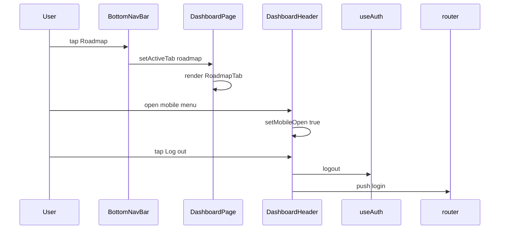

This flow shows the two different navigation styles in the dashboard experience:

- tab switching is local state driven and stays inside the dashboard shell
- logout uses the auth context and routes the user to the login page
- the mobile header menu is a separate UI layer from the tab dock

## Implementation Notes

| File | Dependency | Role in navigation |
| --- | --- | --- |
| `frontend/app/dashboard/page.jsx` | `Link` from `next/link` | Brand and header links |
| `frontend/app/dashboard/page.jsx` | `useRouter` from `next/navigation` | Logout redirect |
| `frontend/app/dashboard/page.jsx` | `Menu`, `X` from `lucide-react` | Mobile menu toggle icons |
| `frontend/app/dashboard/page.jsx` | `motion`, `AnimatePresence` from `framer-motion` | Header dropdown and tab content animation |
| `frontend/components/dashboard/BottomNavBar.jsx` | `LayoutDashboard`, `Map`, `MessageCircle`, `UserCircle` | Bottom tab icons |
| `frontend/components/dashboard/DashboardSidebar.jsx` | `LayoutDashboard`, `Map`, `MessageCircle`, `User` | Sidebar tab icons and profile icon |
| `frontend/components/dashboard/DashboardSidebar.jsx` | `Image` from `next/image` | Profile avatar |


## Key Files Reference

| File | Responsibility |
| --- | --- |
| `frontend/app/dashboard/page.jsx` | Assembles the dashboard shell, defines `TABS`, and renders the inline `DashboardHeader` and `BottomNavBar` |
| `frontend/components/dashboard/BottomNavBar.jsx` | Renders the floating mobile-friendly tab switcher for `dashboard`, `roadmap`, `mentor`, and `account` |
| `frontend/components/dashboard/DashboardSidebar.jsx` | Provides an alternate desktop sidebar and mobile bottom nav with a profile card and three dashboard tabs |


---

